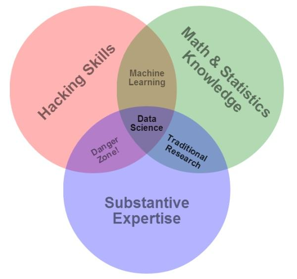

<!--
 * @Author: Johannes Liu
 * @LastEditors: Johannes Liu
 * @email: iexkliu@gmail.com
 * @github: https://github.com/johannesliu
 * @Date: 2021-08-08 02:22:28
 * @LastEditTime: 2022-11-13 18:04:38
 * @motto: Still water run deep
 * @Description: Modify here please
 * @FilePath: \Learning_Advanced_Mathematics_with_Python\Chapter1\1.1-Data_Science_Introduction.md
-->
# 1.1 数据科学

## 1.1.1 数据科学

数据科学，也被称为数据驱动科学，是一个跨学科的领域，研究从各种形式的数据中提取知识或洞见的科学方法、过程和系统，无论是结构化的还是非结构化的，类似于数据库中的知识发现(KDD)。

数据科学是一个“统一统计、数据分析及其相关方法的概念”，目的是用数据“理解和分析实际现象”。它采用了来自数学、统计学、信息科学和计算机科学等广泛领域的技术和理论，特别是来自机器学习、分类、聚类分析、数据挖掘、数据库和可视化等子领域的技术和理论。

>\---- wikipedia

数据科学是一个跨学科的课题，Drew
Conway于2010年9月在自己的博客上首次发表了数据科学韦恩图:

该图解释了数据科学研究者等所应掌握的三种基本知识：数学与统计知识，黑客知识，领域专家知识。但是如果希望成为一名数据科学家，除了掌握这些基本知识外，还需要具备Jake
VanderPlas在《Python数据科学手册》提出的三种领域能力：统计学家的能力——数据建模、数据集合；计算机科学家的能力——算法设计、数据存储、数据分析与数据可视化；领域专家的能力——在细分的学科领域中经过专业的训练，这样既可以提出正确的问题，又可以做出正确的解答。

我们在进行数据科学实践时，会对不同细分领域所涉及到的分类、回归、聚类等问题进行展开讨论。在学习过程中中，我们重在掌握数据科学中的原理与技术，并不要求您对于这些细分领域所涉及到的专业知识进行深度探索，除非您希望成为该领域的专家。

## 1.1.2 为什么选择Python

当销售人员向客户推荐产品时，总逃不过回答这样几个问题，“产品是否符合我们的需求？”，“产品相对与其他厂商的有什么优势？”。当我们在向读者推荐Python语言来进行数据科学实现时，也总是绕不开相似的问题，因此我们需要回答“在茫茫多的编程语言中，为什么我们选择了Python。”

“人生苦短，我用Python”作为IT界广泛流传的格言，揭示了Python语言无可比拟的开发效率。Python官方教程所写：“Python是一门既容易上手又强大的编程语言。”不仅反映了Python的开发效率之高，而且也表明，Python作为一门高级动态语言，拥有与C、C++等老牌编程语言同样强大的功能。具体来说，Python有以下特点。

1. 语法简洁

Python语言中的关键字很少，不需要使用分号，大括号，begin和end标记。可以使用循环和条件语句进行数据结构初始化。相对于C、C++和Java等主流静态类型语言，Python极大地提高了开发者的开发效率：Python代码长度往往只有主流静态类型语言代码长度的1/5\~1/3。且Python语言因无需静态语言所需要的编译、链接等步骤，进一步提高了程序员的效率。

2. 便于移植

Python语言，作为一种脚本语言，具有跨平台的特性。任何一种计算机操作系统，只要安装了Python解释器，就可以直接在其上运行Python程序，而不需要对其进行任何修改。也就是说，Python程序在各个平台下具有一致性。

3. 易于扩展

Python语言在设计之初，就将编程语言的可扩展性考虑其中。具体体现在，Python语言可以集成C、C++、Java等所编写的代码，用相关接口和函数库将它们“粘起来”。而且，Python文件（后缀为.py）既等同于可执行文件，又可以作为功能模块来使用。

4. 类库丰富：

不仅Python标准库提供了丰富的内置类和库函数，还有大量的第三方类库可以使用。不管是科学计算和游戏开发，还是机器学习与图像处理等，Python都可以凭借庞大的第三方类库来与在相关领域具有优势的编程语言一决高下。且Python语言因为其易用性与健壮性，受到越来越多专业与非专业编程人士的广泛欢迎。不仅仅有数量庞大的商业公司在为Python构建功能强大的类库，而且有数不清的Python爱好者通过开源平台为Python社区提供力量。

5. 高级重用机制：

Python不仅支持面向过程编程方式，而且支持软件开发的高级重用机制，例如面向对象编程（object-oriented，OO）和函数式编程（function
programming）。满足不同编程人士对不同编程方式的需求。

简言之，使用Python进行数据科学实践工具，不仅大大提高了编程效率，而且可以获得数不清的Python爱好者的支持。
