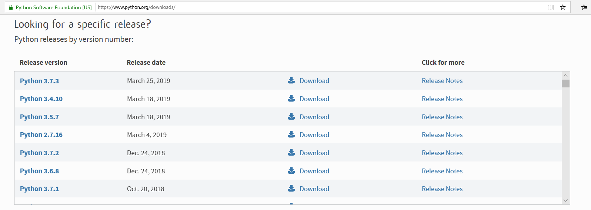
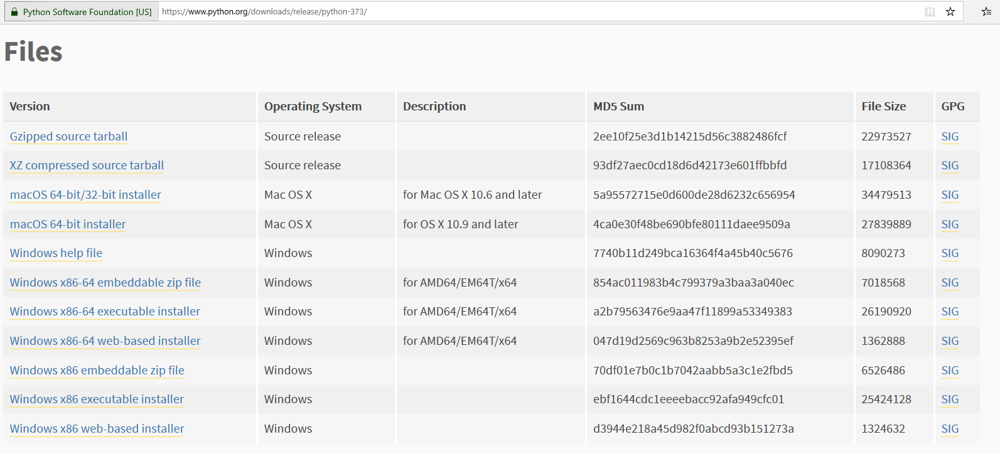
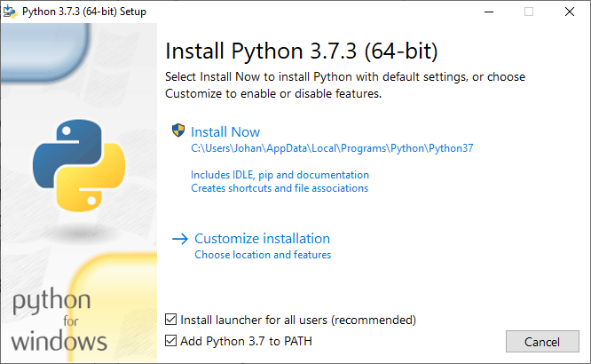
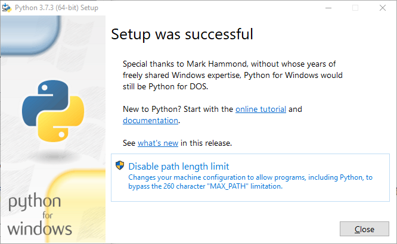
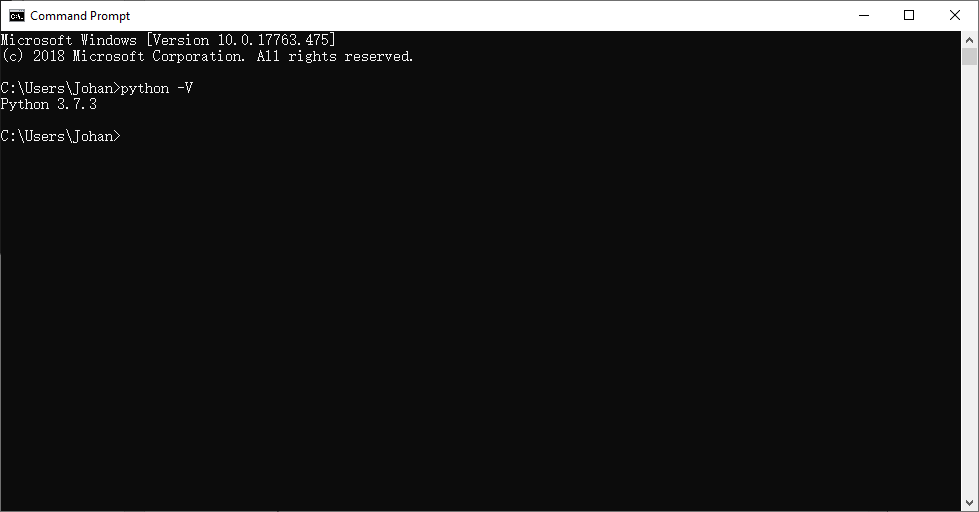
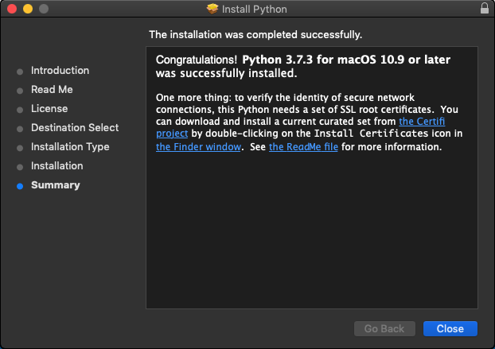
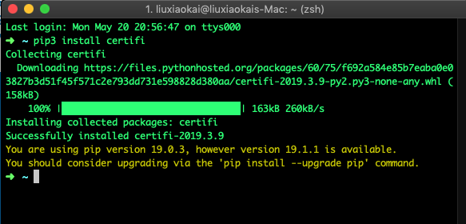

# 1.2 安装Python

Python不仅安装和配置开发环境非常简单，而且可以进行跨平台下进行安装和开发。本节将介绍如何下载并在三大主流操作系统（Windows，Linux和Mac
OS X）安装Python解释器。

我们在此以安装Python最新版本（Python 3.7.3）为例，进行讲解。因为Python
2.7的安装过程与Python
3.7的相似，Linux下的环境配置与MacOS下的环境配置相似等，因此我们只在必要的地方进行补充说明，不再过多赘述。

但是值得注意的是，因为\*nix系统中部分系统文件依赖系统集成的Python 2.x或者Python
3.x，所以如果直接修改或删除，可能导致系统故障！因此，我们不建议对系统自带的Python版本进行任何改动！

## 1.3.1 Windows下Python的下载和安装

我们可以通过Python官网：<https://www.python.org/downloads>下载Python的各个版本，如图1-1所示。

图1-1 选择合适的Python版本

我们在此已安装Python最新版本（Python
3.7.3）为例，对会进入如图1-2所示的下载页面，页面下方的表格中提供了各个目标系统对应的下载项。这里选择“Windows
x86-64 executable installer”选项。此时会启动安装文件的下载。

图1-2 选择相应的操作系统

待下载结束后，双击exe文件进行安装，单击Install
Now进行安装或自定义安装，这里点击Install Now进行自动安装，如图1-3所示。

图1-3 选择安装路径

要在控制台中使用Python，还需要将Python的解释器所在目录添加到环境变量当中。选择Add
Python 3.7 to
PATH，可在安装过程中自动将Python解释器所在目录添加到环境变量中。继续单击“Next”按钮，提示安装成功！如图1-4所示，通过单击Disable
path length limit禁用windows系统的Path长度限制，避免在将来开发中可能的一些问题。

图1-4

虽然Python3.7.3安装程序可以自动帮我们解决系统环境变量配置问题，但是在一些特殊的情况，如Python
2.7.11安装程序，不能自动对系统环境变量进行配置，需要人工对系统环境变量进行配置。关于人工环境变量配置方法，详见第二章。

最后，我们需要测试是否配置成功，打开cmd，键入python
\-V。如果安装成功，应该显示Python的安装版本，如图1-7所示。

图1-8 在命令提示符中检查Python配置

至此，Windows下的python环境配置工作全部完成。

## 1.3.3 Linux下Python的下载和安装

Ubuntu 19.04集成python
3.7.3，但是没有集成相应版本包管理工具——pip3，也没有集成python
2与pip2。为了便于满足使用不同Ubuntu发行版的用户的需求。我们在此介绍Ubunut下python
2.7，3.7以及pip2，pip3的安装方法以及相关环境配置方法。

第一步，根据具体需求，我们安装不同版本的python以及pip。

1.  Python 2.7 的安装

    Input：sudo apt install python3.7

2.  python 3.7 的安装

    Input：sudo apt install python2.7

3.  pip3的安装

    Input：sudo apt install python3-pip

4.  pip2的安装

    Input：sudo apt install python-pip

第二步，定义别名

在开发中，我们需要对不同版本python与pip定义别名。一般来说，我们让python指向python3，pip指向pip3。

1.  查找python与pip的位置

Input：whereis pip

Output：pip:/usr/local/bin/pip /usr/local/bin/pip36 /usr/local/bin/pip2.7

Input：whereis python

>   Output：python: /usr/bin/python2.7 /usr/bin/python2.7-config
>   /usr/bin/python3.7m /usr/bin/python3.7 /usr/bin/python3.7m-config
>   /usr/bin/python3.7-config /usr/bin/python /usr/lib/python2.7
>   /usr/lib/python3.7 /usr/lib/python3.7 /etc/python2.7 /etc/python3.7
>   /etc/python /usr/local/lib/python2.7 /usr/local/lib/python3.7
>   /usr/include/python2.7 /usr/include/python3.7m /usr/include/python3.7
>   /usr/share/python /usr/share/man/man1/python.1.gz

>   可见python3在/usr/bin/python3.7，pip3在 /usr/local/bin/pip3.7

1.  自定义别名

    Input: vim \~/.bashrc

    跳转最后一行，输入

    alias python=/usr/bin/python3.7

    alias pip=/usr/local/bin/pip3.7

第三步，更新环境

source \~/.bashrc

至此，Ubuntu下的python环境配置工作全部完成。

## 1.3.4 Mac OS X下Python的下载和安装

MacOS已集成Python 2.x。因为贸然修改系统自带的Python
2.x版本会导致某些系统文件失效，进而造成诸多不必要的麻烦。所以，尽量不要替换或删除系统自带的Python
2.x。

可以通过Python官网：<https://www.python.org/downloads>/release/python-373下载macOS
64-bit Installer，来安装python
3.7.3。也可以通过homebrew安装Python。我们这里以通过Python官网安装为例，进行讲解。

Mac下的Python安装过程相当简单，我们只需一路点击下一步（Continue）即可完成安装。如图1-9所示。

图1-9 Python安装信息

图1-10 安装certifi

最后，按照上图提示，我们打开terminal，输入pip3 install
certifi来完成网络配置工作，如图1-10所示。

至此Mac OS X下的Python环境配置工作全部完成。