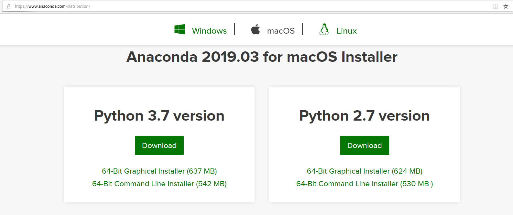
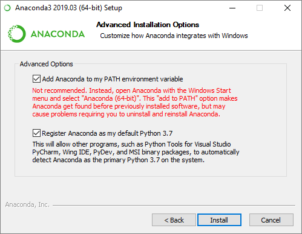
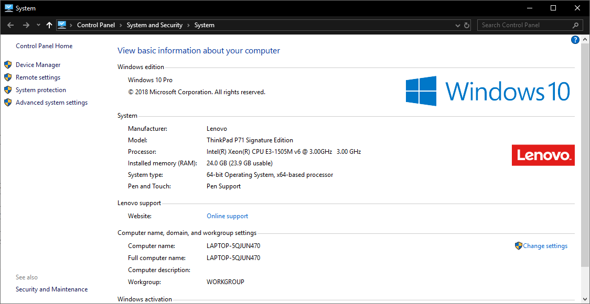
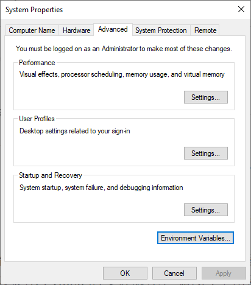
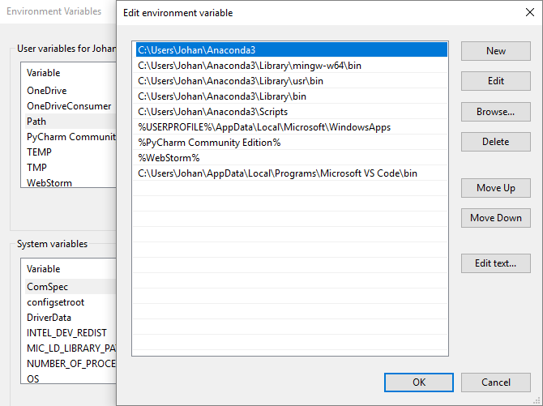
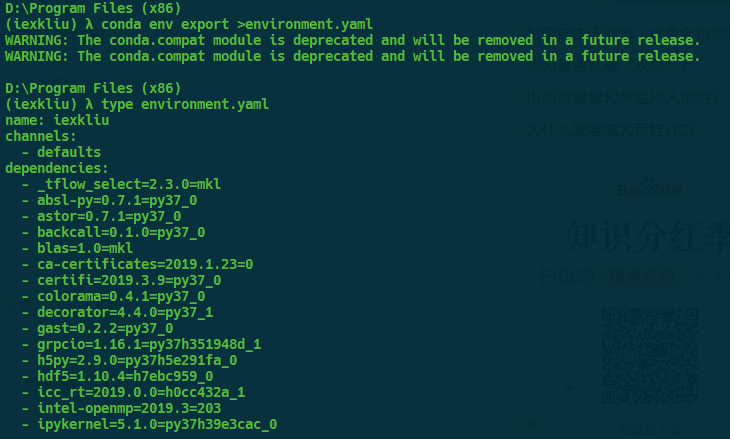

# 1.4 Anaconda


## 2.2.1 Anaconda简介

Anaconda的中文译名为蟒蛇。它是一个极其流行的，开源的Python发行版本，因包含大量的第三方类库及其依赖项而著名。使用Anaconda可以快速安装、运行和升级包及其依赖项。

此外，开发者在开发过程中经常会遇到Python版本或Python库版本不符合需求的问题，需要对Python版本或Python库版本进行升级或者降级，然而这种操作即有可能产生连锁反应，使得python与库之间，库与库之间产生不兼容问题，进而导致Python环境被污染。这时候，使用Anaconda可以方便开发者对Python环境进行管理。使用Anaconda建立的Python环境与系统Python环境和与Anaconda建立的其他Python环境是完全隔离的。这就保障了不同Python环境之间是相互独立的。Anaconda克服了virtualenv工具的不足，使创建环境变得简单。

所谓一图胜千言，表2.3将conda，pip，virtualenv工具能力对比，同时列出了各种工具常用指令，从中我们也可以看出Anaconda覆盖pip和virtualenv的所有功能，是包和与环境管理方面无可替代的选择。

表2.3

| 任务           | conda命令                                             | pip命令                                                           | virtualenv命令                                        |
|----------------|-------------------------------------------------------|-------------------------------------------------------------------|-------------------------------------------------------|
| 安装包         | conda install \$PACKAGE_NAME                          | pip install \$PACKAGE_NAME                                        |                                                       |
| 更新包         | conda update --name \$ENVIRONMENT_NAME \$PACKAGE_NAME | pip install --upgrade \$PACKAGE_NAME                              |                                                       |
| 更新包管理工具 | conda update conda                                    | Linux/macOS: pip install -U pip Win: python -m pip install -U pip |                                                       |
| 卸载包         | conda remove --name \$ENVIRONMENT_NAME \$PACKAGE_NAME | pip uninstall \$PACKAGE_NAME                                      |                                                       |
| 创建环境       | conda create --name \$ENVIRONMENT_NAME python         |                                                                   | cd \$ENV_BASE_DIR; virtualenv \$ENVIRONMENT_NAME      |
| 激活环境       | conda activate \$ENVIRONMENT_NAME\*                   |                                                                   | source \$ENV_BASE_DIR/\$ENVIRONMENT_NAME/bin/activate |
| 注销环境       | source deactivate                                     |                                                                   | deactivate                                            |
| 查找可用包     | conda search \$SEARCH_TERM                            | pip search \$SEARCH_TERM                                          |                                                       |
| 从特定源安装包 | conda install --channel \$URL \$PACKAGE_NAME          | pip install --index-url \$URL \$PACKAGE_NAME                      |                                                       |
| 列举包         | conda list --name \$ENVIRONMENT_NAME                  | pip list                                                          |                                                       |
| 创建需求文件   | conda list --export                                   | pip freeze                                                        |                                                       |
| 列举环境       | conda info --envs                                     |                                                                   | Install virtualenv wrapper, then lsvirtualenv         |
| 安装包管理工具 | conda install pip                                     | pip install conda                                                 |                                                       |
| 安装python     | conda install python=x.x                              |                                                                   |                                                       |
| 更新python     | conda update python\*                                 |                                                                   |                                                       |

我们先前已经对pip和virtualenv命令进行了讲解，我们将会在2.2.3，2.2.4节对conda命令进行讲解。

## 2.2.2 Anaconda的安装

## Windows

我们通过https://www.anaconda.com/distribution/下载所需要的版本，如图2.2所示。



图2.2 Anaconda下载页面

下载完成后，双击进行安装，选择路径，我们推荐把Anaconda3加入环境变量，同时把Anaconda默认环境所带解释器作为系统默认的Python解释器，如图2.3所示。



图2.3 Anaconda3的安装

人工配置环境变量，可遵循以下步骤。

第一步：右击“计算机”（Windows
10操作系统中为“此电脑”），选择“属性”选项，打开“系统”窗口，如图1-5所示。



图1-5 进入“系统”窗口

第二步：选择“高级系统设置”（Advanced system
settings）选项，单击“高级”选项卡的“环境变量”按钮，如图1-6所示。

第三步：将Anaconda的相关安装路径（编者的路径为C:\\Users\\Johan\\Anaconda3）添加到Path变量中，如图1-7所示。



图1-6 单击“环境变量”按钮



图1-7 配置Path环境变量

在这里我们将Anaconda的相关安装路径加入了用户环境变量。这样做的好处使，当该PC有多位用户使用时，不会因为用户环境变量不同而发生冲突。

此外，还可以将Anaconda的相关安装路径加入系统环境变量。这样做会对PC上的所有用户都会生效。

## Ubuntu

我们通过https://www.anaconda.com/distribution/下载所需要的版本。在下载所得文件Anaconda3-2019.03-Linux-x86_64.sh所在的目录下键入如下命令：
```bash
sudo chmod +x ./ Anaconda3-2019.03-Linux-x86_64.sh
```
./Anaconda3-2019.03-Linux-x86_64.sh \#不要在root下安装

接受许条款后，选择Anaconda的安装路径，我们建议在默认家路径下进行安装。一路确认，即可完成

Ubuntu配置用户环境变量的方法如下：

在terminal中输入
```bash
sudo vim \~/.bashrc //ashrc是用户级环境变量，只对当前用户有效
```
在.bashrc中输入：
```bash
export PATH=\~/anaconda3/bin:\$PATH \#将anaconda3加入到用户环境变量前
```
此外，还可以将anaconda3加入到系统环境变量中，需要修改的文件为/etc/profile，其他操作一致。

## Mac OS X

从官网下载Mac OS X
的anaconda安装程序。当安装程序运行时，它会自动将anaconda可执行文件路径附加到.bash\_profile中。这位于/users/\$user/.bash_profile。要验证一切正常，请尝试在系统shell中启动ipython（打开终端应用程序以获取命令提示）：

可以采用与Ubuntu相同的人工环境变量配置方法对Mac OS
X的环境变量进行人工配置。更多Mac OS X的环境变量配置方法，请参照官方文档。

## 2.2.3 包管理

## 查询包

查询已安装的包命令如下：
```bash
conda list
```
模糊查询：
```bash
conda serach item_name \#item_name为包的部分拼写
```
## 安装包

在安装包的过程中，conda还会自动安装依赖项。例如：scikit-learn需要依赖于Numpy，Scipy如果只安装scikit-learn，则conda还会安装Numpy,
Scipy

包安装命令如下：
```bash
conda install package_name1 [package_name2 Package_name3 … Package_namen]
```
## 卸载包

包卸载命令如下
```bash
conda remove package\_name1[ package_name2 Package_name3 … Package_namen]
```
## 更新包

包更新命令如下
```bash
conda update package_name1[ package_name2 Package_name3 … Package_namen]
```
更新所有包命令如下：
```bash
conda update –all
```
## 切换源

熟悉\*nix的读者在使用apt或homebrew工具安装软件时往往需要对第三方源进行配置，在一些特殊的情况下，还需要对软件源的优先级进行指定。conda作为一种强大的包管理工具，同样允许使用者自定义安装源。

在安装包一节中，我们使用conda install
packge_name的方式，从默认频道中安装或更新包。然而，对某些领域的专业人士来说，官方默认频道(Continuum)往往无法提供他们所需要的包。这是，就需要人工指定conda的安装源。

有两种更改安装频道的方法，一种是每次指定一个频道对包进行安装：
```bash
conda install -c some-channel packagename
```
另一种是，将经常使用的频道，添加到conda配置中。当多个频道均具有特定的安装包时，conda根据配置列表种第三方频道的先后顺序确定频道优先级，进行包的安装。

下述命令将频道some_channel添加到channels配置列表的顶部（最高优先级）：
```bash
conda config --add channels some-channel
```
下述命令将频道some_channel添加到channels配置列表的底部（最低优先级）：
```bash
conda config --append channels some-channel
```
删除channels配置列表中的频道：
```bash
conda config --remove channels some-channel
```
conda-forge是除了默认频道外最常用的conda频道。conda-forge是为了建立和维护软件包由社区主导的python包的集合，为conda包管理器构建基础结构和发行版。

我们使用conda-forge取代默认频道往往基于以下两方面原因：

1.  conda-forge往往可以提供默认频道不能提供的包

2.  conda-forge往往可以提供更新的包

除了conda-forge源以外，还存在生物信息学常用的binconda源等，在此不再熬述。

## 2.2.4 环境管理

## 查询环境

查询环境命令如下：
```bash
conda env list
```
## 创建环境

创建环境命令如下：
```bash
conda create -n env_name package_name1[ package_name2 package_name3 …
package_namen]
```
此命令会创建包含若干包的Python环境，其中 -n 后边跟环境名称

例如：conda create -n iexkliu pandas
matplotlib，这样便会创建包含pands和matplotlib的python运行环境

同时，在创建环境时，可以指定安装在环境中的编程语言

如我们希望在安装环境时同时获得python2，python3，C++语言的支持：

## 进入环境

进入环境命令如下

activate env_name \#对于Linux和Mac用户，键入source activate env_name

## 注销环境

进入环境命令如下

deactivate env_name \#对于Linux和Mac用户，键入source deactivate env_name

## 共享环境

1.  导出环境

共享环境可以让他人安装我们的开发环境中所使用的包。且新安装的包的版本与我们所写的代码中用到的包的版本是一致的。

共享环境的命令如下：
```bash
conda env export \> environment.yaml
```
通过这条命令可以将当前环境保存到终端当前目录下。键入type
environment.yaml可以查看该环境配置文件的内容，亦可以使用记事本打开。

在 GitHub
上共享代码时，最好同样创建环境文件并将其包括在代码库中。这能让其他人更轻松地安装你的代码的所有依赖项。

1.  导入环境

首先我们需要激活被导入环境，如我们的被导入环境为inport_env接着，我们使用如下命令将environment.yaml中环境配置导入到当前环境：
```bash
conda env update -f=/path/to/enviroment.yml
```
其中-f表示环境配置导出文件所在的本地路径。



## 删除环境

删除环境的命令如下：
```bash
conda env remove -n env_name 删除指定的环境
```
## 2.3 Jupyter

## 2.3.1 初识Jupyter

## Jupyter项目

Jupyter项目是一个非盈利的开放源代码项目，2014年从IPython项目中诞生，因为它发展到支持跨所有编程语言的交互式数据科学和科学计算。Jupyter将始终是100%开源软件，免费供所有人使用，并根据修改后的BSD许可证的自由条款发布。

Jupyter是通过Jupyter社区的共识在Github上公开开发的。Jupyter项目的存在是为了开发开放源代码软件、开放标准和跨几十种编程语言的交互式计算服务。

## Ipython

IPython提供了对Python编程语言的扩展，使交互工作变得方便和高效。这些扩展是在ipython内核中实现的，并且在运行这个内核时，可以在所有ipython前端（笔记本、终端、控制台和qt控制台）中使用。

## Jupyter Notebook

Jupyter
Notebook是一个开源的Web应用程序，允许您创建和共享包含实时代码、公式、可视化和叙述性文本的文档。用途包括：数据清洗和转换、数值模拟、统计建模、数据可视化、机器学习等。

Jupyter项目的一个主要组成部分是笔记本，一种用于代码、文本（带或不带标记）、数据可视化和其他输出的交互式文档。Jupyter笔记本与内核交互，内核是Jupyter交互式计算协议的任何编程语言的实现。python的Jupyter内核使用ipython系统作为其底层行为。

Jupyter Notebook拥有以下优点：

1.  多种语言支持

    该笔记本支持40多种编程语言，包括python、r、julia和scala。

2.  共享笔记本

    笔记本可以通过电子邮件、Dropbox、Github和Jupyter笔记本查看器与其他人共享。

3.  交互式输出

    您的代码可以生成丰富的交互式输出：HTML、图像、视频、乳胶和自定义MIME类型。

4.  大数据融合

    利用来自python、r和scala的大数据工具，如ApacheShark、Pandas、Scikit
    Learn、Ggplot2、TensorFlow一起探索相同的数据。