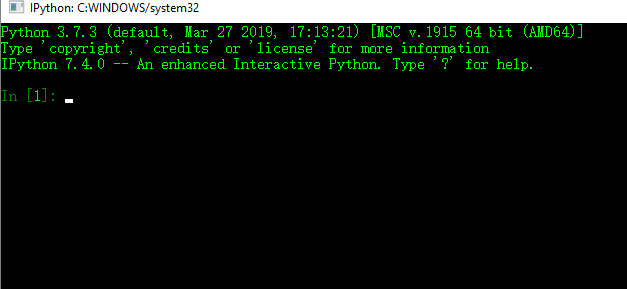
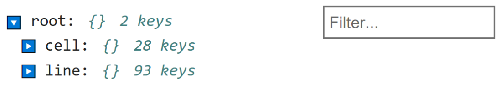
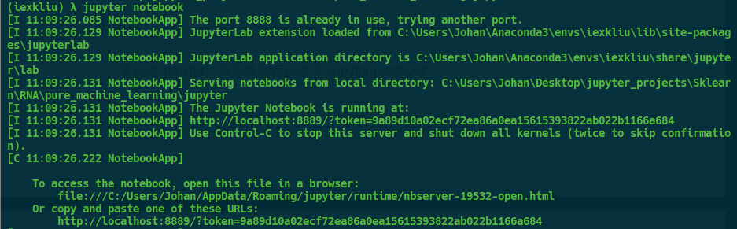
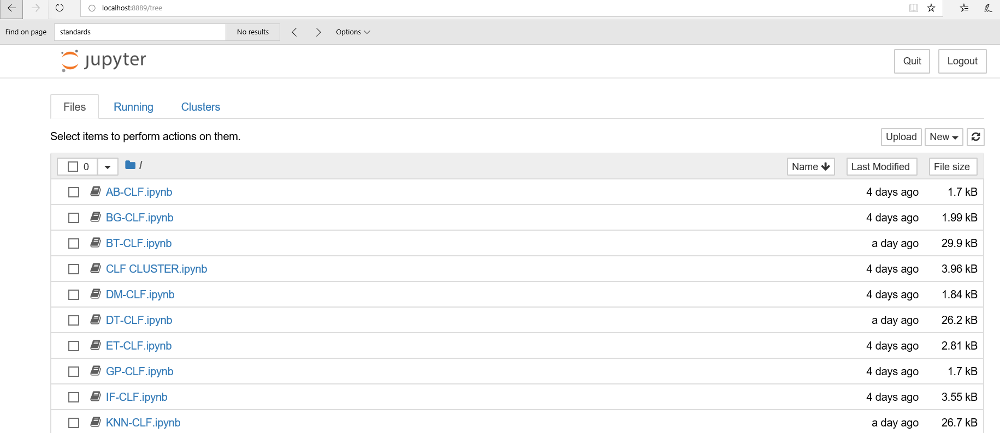
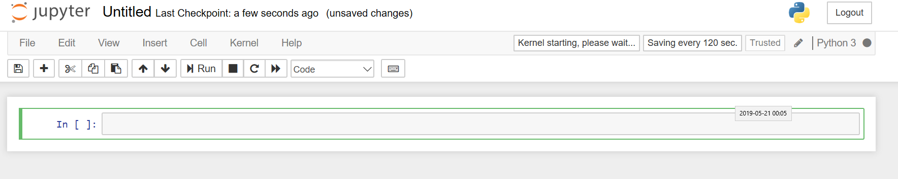
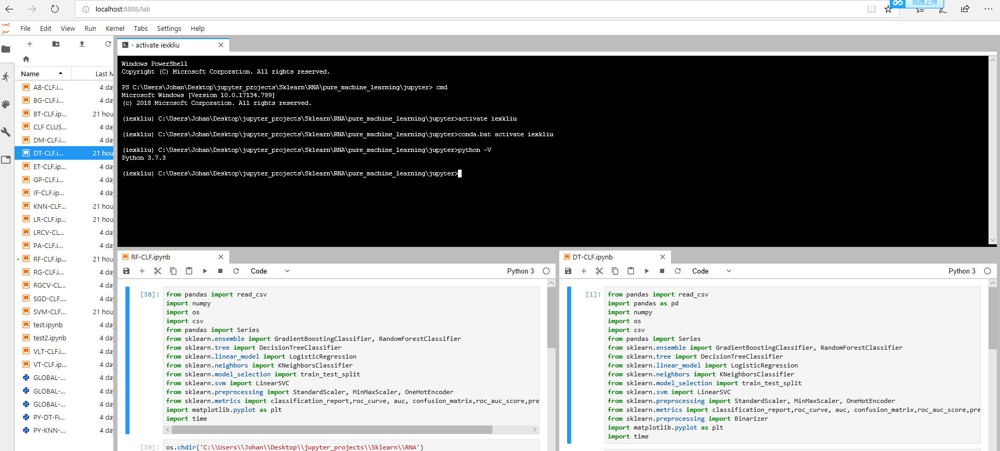

# 1.5 Jupyter


JupyterLab是jupyter项目下一代基于Web的用户界面。Jupyter Lab极大地拓展了Jupyter
Notebook的功能，提供了更为优秀的用户体验。使用Jupyter
Lab，我们可以同实在一个浏览器界面打开并编辑多个Notebook，Jupyter
console和cmd终端（对于\*nix来说，是terminal），并且支持预览和编辑更多种类的文件，如diamagnetic文件，Markdown文档，json，yml，csv，等，还可以使用Jupyterlab连接Onedrive等云存储服务，极大得提升了生产力。且Jupyter
Lab遵循Jupyter社区指南。

## 2.3.2 IPython

## 安装

安装Ipython
```python
pip install ipython
```
安装并在Jupyter中注册Ipython核心：
```python
python -m pip install ipykernel

python -m ipykernel install [--user] [--name \<machine-readable-name\>]
[--display-name \<"User Friendly Name"\>]
```

更多帮助
```python
python -m ipykernel install --help
```
## 基本使用

除了ipython命令外，您可以在命令行上启动ipython
shell，就像启动常规的python解释器一样：


 
您可以通过键入任意的python语句并按回车键（或回车键）来执行这些语句。当只在IPython中键入一个变量时，它将呈现对象的字符串表示形式：

许多种类的python对象的格式都是为了更可读或更美观地打印，这与普通的打印方式不同。如果您在标准的python解释器中打印这些数据变量，那么它们的可读性将大大降低：

print函数

IPython还提供了执行任意代码块（通过某种美化的复制粘贴方法）和整个Python脚本的工具。您也可以使用JupyterNotebook来处理较大的代码块。

从表面上看，ipython外壳看起来像是标准终端python解释器（用python调用）的一个不同版本。与标准的python
shell相比，它的一个主要改进是标签完成，在许多IDE或其他交互计算分析环境中都可以找到。在shell中输入表达式时，按tab键将在命名空间中搜索与迄今键入的字符匹配的任何变量（对象、函数等）。、

Ipython是Jupyter Notebook与Jupyter
Lab的基础，只要掌握了Ipython的用法，就可以轻松的将开发环境迁移到Jupyter
Notebook与Jupyter Lab上来。我们鼓励您在Jupyter Labs上对本节代码进行实践。

## 读取文档

使用计算机编程技术在科学研究和工程应用中解决问题，最频繁的需求之一就是获取文档。在Python中，每一个对象都有一个文档字符串(docstring)的引用。该文档字符串，包含了Python对象的概述、用法等相关信息。使用help()函数可以获取这些对象的使用方法。当help函数作用于函数或者方法时，help函数还可以返回他们的用法。下面让我们使用help()函数获取abs函数的用法.
```python
In[1]：help(abs)

Help on built-in function abs in module builtins:

abs(x, /)

Return the absolute value of the argument.
```

此外，在Ipython中还可以使用问号”?”获取文档。让我们在Ipython中试试吧！
```python
In[1]: ?abs

**Signature:** abs**(**x**,** **/)**

**Docstring:** Return the absolute value of the argument.

**Type:** builtin_function_or_method
```
符号”?”既可以放在行首也可以放至行尾。

在Ipython中获取列表的文档:
```python
In[1]: list?

**Init signature:** list**(**iterable**=(),** **/)**

**Docstring:**

Built-in mutable sequence.

If no argument is given, the constructor creates a new empty list.

The argument must be an iterable if specified.

**Type:** type

**Subclasses:** \_HashedSeq, StackSummary, SList, \_ImmutableLineList,
FormattedText, NodeList, \_ExplodedList, Stack, \_Accumulator, \_ymd, ...
```
如果，我们需要创建自己的函数或自定义对象，希望获取他们的文档，又该怎么做呢？只需要在函数或对象创建语句的第二行以多行注释的形式加入注释，就完成了文档的创建。

我们创建一个计算平方数的函数，并创建文档
```python
In[]:def square(x):

'''

Return the square of x'''

return x\*x

square(3.14)

Out[]:9.8596

查看square函数的文档：

In[]:? square

**Signature:** square**(**x**)**

**Source:**

**Signature:** square**(**x**)**

**Docstring:** Return the square of x

**File:** d:\\jupyterdo\\\<ipython-input-74-563ca1869869\>

**Type:** function

我们创建一个狗的基类，并创建文档

In[]:class Dog:

'''

dogs' base class

'''

dogCount=0

def \_\_init\_\_(self, name, age):

self.name = name

self.age = age

Dog.dogCount += 1

def showcount(self):

print("Total dogs %d" % dogCount.dogcount)

def showage(self):

print("Name : ", self.name, ", Age: ", self.age)

In[]:? Dog

**Init signature:** Dog**(**name**,** age**)**

**Docstring:** dogs' base class

**Type:** type

**Subclasses:**
```
查看Dog类的文档：
```
In[]:? Dog

**Init signature:** Dog**(**name**,** age**)**

**Docstring:** dogs' base class

**Type:** type

**Subclasses:**
```
## 读取源代码

在Ipython中可以使用双问号”??”获取源代码。

查看square函数的源代码：
```
In[]:?? square

**Signature:** square**(**x**)**

**Source:**

**def** square**(**x**):**

**'''**

**Return the square of x'''**

**return** x**\***x

**File:** d:\\jupyterdo\\\<ipython-input-74-563ca1869869\>

**Type:** function
```
查看Dog.showage方法的源代码：
```
In[]:?? Dog.showage

**Signature:** Dog**.**showage**(**self**)**

**Docstring:** \<no docstring\>

**Source:**

**def** showage**(**self**):**

print**("Name : ",** self**.**name**,** **", Age: ",** self**.**age**)**

**File:** d:\\jupyterdo\\\<ipython-input-67-b51896ab7fa6\>

**Type:** function
```
## 快捷键

Ipython中的快捷键分为四类：导航快捷键、文本输入快捷键、命令历史快捷键与其他快捷键。表2.4对这些快捷键进行了简要的介绍。掌握这些快捷键会使编程工作事半功倍。如果您拥有\*nix下shell或者文本编辑器(Vim、Emacs等)的使用经验，您将会很快上手。

表2.4 Ipython常用快捷键

| 类别           | 快捷键                 | 描述                 |
|----------------|------------------------|----------------------|
| 导航快捷键     | Ctrl + a               | 移动光标至行首       |
|                | Ctrl + e               | 移动光标至行尾       |
|                | Ctrl + b（或方向左键） | 向后移动光标         |
|                | Ctrl + f（或方向右键） | 向前移动光标         |
| 文本输入快捷键 | Backspace              | 删除前一个字符       |
|                | Ctrl + d               | 删除后一个字符       |
|                | Ctrl + u               | 从行首剪切字符至光标 |
|                | Ctrl + k               | 从光标剪切字符至行尾 |
|                | Ctrl + y               | 粘贴文本             |
|                | Ctrl + t               | 交换前两个字符       |
| 命令历史快捷键 | Ctrl + p（或方向上键） | 获取前一个历史命令   |
|                | Ctrl + n（或方向下键） | 获取后一个历史命令   |
|                | Ctrl +r                | 对历史命令的反向搜索 |
| 其他快捷键     | Ctrl + l               | 清除终端内容         |
|                | Ctrl + c               | 中断命令             |
|                | Ctrl + d               | 退出Ipython会话      |

## I/O记录

除了使用Ctrl+p和Ctrl+n快捷键获取历史命令。Ipython还提供了多种获取历史命令的而输出方式。我们将会在本节对这些命令进行介绍。

## IPython输入输出对象

经过前边简单的例子，您可能已经熟悉了IPython的输入输出提示符In[]和Out[]。这些In/Out提示符实际上就是本节所讲的IPython输入输出对象。它们不仅形式美观，还提供了获取输入和输出历史的功能。只需输入希望查看的代码所在的输入或输出提示符，就可以查看输入输出历史：
```python
In[10]: In[1]

Out[10]:’help(abs)’

Out:[11]: Out[22]

Out[11]: ’help(abs)’
```
但不是所有的In[]对象都有一个与之配对的Out[]对象，

还可以使用不带编号的In与Out对象，查看所有输入和输出记录。其中In是一个列表，按照命令的运行顺序记录命令。Out对象是一个字典，字典的键是输入对象的序号，字典的值是输入对象的输出。
```python
In[12]:In

Out[12]: ['', 'help(abs)', "get_ipython().run_line_magic('pinfo', 'abs')",
"get_ipython().run_line_magic('pinfo', 'list')",

…

'In[1]', 'Out[10]', 'In']

In[12]:Out

Out[12]: {4: 9.8596, 10: 'help(abs)', 11: 'help(abs)', 12: ['', 'help(abs)',
"get_ipython().run_line_magic('pinfo', 'abs')",

…

'In[1]',

'Out[10]',

'In',

'Out']}
```
## 输出历史

除了使用Out[]与Outdui想获取输出历史外，还可以通过下划线符号”\_”获取历史输出。

使用单下划线，可以查看前一条历史输出，使用双下划线，可以查看前两条历史输出。使用三下划线则可以查看前三条历史输出。
```python
In[]:print(\_)

Out[]:{4: 9.8596, 10: 'help(abs)', 11: 'help(abs)', 12: ['', 'help(abs)',
"get_ipython().run_line_magic('pinfo', 'abs')",

…

'In[1]',

'Out[10]',

'In',

'Out']}

In[]:print(\__)

Out: ['', 'help(abs)', "get\_ipython().run_line_magic('pinfo', 'abs')",
"get_ipython().run_line_magic('pinfo', 'list')",

…

'In[1]', 'Out[10]', 'In']

In[]:print(\_\_\_)

Out[]:help(abs)
```
IPython至多支持三条下划线查看历史输出。当需要查看超过三条以上的历史输出时，请使用Out[]对象。

## 抑制输出

如果不希望某句代码的输出保存在输出历史中，就需要对某一句代码的进行输出抑制。最简单的输出抑制方法就是在代码行末加入一个分号”;”。
```python
In[]:3+2;
```
值得注意的是，分号仅仅抑制了Ipython的输出，但是并没有抑制代码的运算。

## shell命令

Python作为一种解释语言的一大优势在于它的可交互性。就像\*nix用户与shell交互的的那样，shell不断将用户命令解释送入内核后运行。然而标准Python解释器下，无法输入shell命令。如果有同时使用python和shell进行开发的需求，那么用户就不得不在标准python解释器与shell之间来回切换。

令人惊喜的是，Ipython提供了执行shell命令的功能。通过在感叹号”!”键入shell命令，Ipython可以像在\*nix
terminal下那样执行shell命令。

如果读者使用的是windows操作系统，也大可不必沮丧。这得多亏了Bash On
windows计划，现在在windows系统中运行\*nix shell命令。Bash On
Windows是微软的“Microsoft Love
Linux”计划中重要的一环，目的是能让Windows用户能在系统中运行Linux子系统(**Windows Subsystem for Linux, WSL)**。用户只需要将计算机升级到windows10
1709版本之后，就可以直接在Windows中获得原生Linux Bash级别的体验。

## 魔法命令

我们在前面已经学习了许多Ipython命令，但是最精彩命令的当属于我们本节所讲的
魔法命令（函数）了！您或许能从其他开发工具上使用之前讲过的普通命令，但是Ipython的魔法命令却独树一帜，拥有强大的功能！

魔法命令有两种形式：行魔法（line magic）和单元魔法（cell
magic）。行魔法命令使用单个百分号“%“字符作为前缀，作用域为单行代码；单元魔法命令使用两个百分号”%%”作为前缀，作用于多行输入。

表2.5 对常见的Ipython魔法命令进行了简要的介绍。

表2.5 Ipython常用魔法命令

| 类别         | 快捷键               | 描述                                 |
|--------------|----------------------|--------------------------------------|
| 魔法函数帮助 | ? \<magic_function\> | 查看魔法命令文档                     |
|              | % magic              | 查看所有魔法命令相关描述，实例       |
|              | % lsmagic            | 查看魔法命令列表                     |
| 代码分析     | % time               | 代码段计时（一次执行）               |
|              | % timeit             | 代码段计时（多次执行以获得更高精度） |
|              | % prun               | 使用分析器运行代码                   |
|              | % lprun              | 使用逐行分析器运行代码               |
|              | % memit              | 测量单个语句的内存使用               |
|              | % mprun              | 使用逐行内存分析其运行代码           |
| 代码调试     | %xmode               | 控制异常                             |
|              | %debug               | 代码调试                             |
| 外部代码粘贴 | %past                | 粘贴代码块                           |
|              | %cpast               | 打开交互式多行输入提示               |
| 外部代码执行 | % run                | 执行外部.py代码                      |

接下来我们将对上述部分魔法命令进行介绍。

## 粘贴代码块

传统的C/C++语言使用括号来控制代码的作用域，在Python中则采用缩进的表示形式来决定代码的作用域。因此，在从其他软件向Ipython解释器粘贴多行代码时，可能会出现缩进错误等错误。使用Ipython的%paste魔法命令可以很好的解决这个问题。而\#cpaste则可以打开一个交互式多行输入提示。

## shell魔法

当我们通过Ipython操作shell时会发现，我们并不能cd命令来改变的工作路径。这是因为，Ipython中的shell命令都是在一个临时的shell中执行的。例如：
```
In[]:! cd \#查看当前工作目录

C:\\

In[]: ! cd D:\\JupyterDo\\source_code_of_.py

In[]: !cd

C:\\

如果希望更改Ipython工作目录，可以使用%cd 魔法命令。

In[]: % cd \#查看当前工作目录

C:\\

In[]: % cd D:\\JupyterDo\\source_code_of_.py

In[]: % cd

D:\\JupyterDo\\source_code_of_.py
```
除了%cd魔法名另外，Ipython中还可以使用%ls, %man, %cp, %mv, % cat, %mkdir, %pwd,
%dir等*nix shell相关的魔法命令

如果想要省略百分号”%”直接使用shell魔法，可以通过%automagic魔法函数进行翻转，翻转后，Ipython工作环境将变为shell环境，无法进行Python代码交互，但是若在代码前加入”%”后，Ipython将会认为此代码为Python代码，会按照Python语言的解释方法对代码进行解释。

对于一些常见的*nix 命令，不需要调用”%”号，就可以实现对应魔法命令的功能。

## 执行外部代码

在实际开发中，有时出于代码重用等需要，我们还要使用到.py文件存储的代码。使用%run魔法命令，可以在IPython会话中运行这些代码，而不需要使用标准Python解释器对他们进行执行。让我们使用魔法命令执行例3.1Bubble_sort.py文件（假设该文件位于D:/JupyterDo/source_code_of_.py下）。该文件的功能是：对10个随机数进行排序。
```python
In[]:%cd D:/JupyterDo/pycode

%run 3.1Bubble_Sort.py

Out[]:D:\\JupyterDo\\pycode

排序前: [0.465243390293376, 0.701488505240007, 0.7796559068947894,
0.6495607567281101, 0.4003995588286813, 0.7207742339736103, 0.5812010361696163,
0.6222503023701531, 0.8460218550960557, 0.3789957134672691]

排序后: [0.8460218550960557, 0.7796559068947894, 0.7207742339736103,
0.701488505240007, 0.6495607567281101, 0.6222503023701531, 0.5812010361696163,
0.465243390293376, 0.4003995588286813, 0.3789957134672691]
```
## 代码分析

IPython提供了许多代码分析魔法命令，如代码计时命令%time，内存分析命令：%memit等。下面我们对这些代码进行逐一介绍。

使用%timeit或%%timeit可以让重复运行单行或整个多行代码来计算代码的平均运行时间。
```python
In[]:%timeit sum(range(100))

Out[]:52.2 µs ± 731 ns per loop (mean ± std. dev. of 7 runs, 10000 loops each)

使用%time或%%time可以计算一次单行或整个多行代码的平均运行时间。

In[]:%time sum(range(1000))

Wall time: 0 ns

Out[]:499500
```
在大部分情况下，重复操作计魔法命令%timeit时可以提高计算代码运行时间的精度，但是在某些情况下，却会引入额外的误差。如，对一个列表进行排序，第一次运行排序程序时，列表中的元素已经有序，因此接下来的排序操作要比第一次排序操作都要快。

但是这并不意味着%time魔法命令%timeit魔法命令更加精确。%timeit命令会在底层阻止系统调用对于计时过程的干扰操作，如Python的垃圾回收。而time却并不会这么做。因此，如果代码运行时间较长而较短的系统延迟对计时影响较小的话，可以使用%time魔法命令。在一般情况下，%timeit要比%time得出的代码运行时间更少。

## 魔法命令文档

Ipython中的魔法命令也有文档。可以在魔法命令行首或行末加上问号“？“来获取目标魔法命令的文档：
```python
In[]:?%time

…

使用%lsmagic魔法命令可以获得所有可用的魔法命令的列表。

In[]:%lsmagic

Out[]:

使用%magic魔法命令可以获得可用魔法命令的通用描述及实例。

%magic

…
```
## 2.3.3 Jupyter Notebook

## 安装

激活python环境，若使用conda安装，则键入：
```bash
conda install jupyter notebook
```
若使用pip安装，则键入：
```python
pip install jupyterlab
```
## 使用

要启动Jupyter，请在终端运行命令Jupyter notebook:



图

在许多平台上，Jupyter将在默认的Web浏览器中自动打开（除非您以无浏览器启动它）。否则，您可以导航到启动笔记本时打印的httpaddress，这里是http://localhost:8888/。如图2-1所示。



图：

要创建新笔记本，请单击“新建”按钮并选择“python
3”。您应该看到类似图2-2的内容。在Jupyter Notebook中，一对In
Out会话被称作一个代码单元（Cell）。单击空代码“cell”并输入一行python代码。然后按shift
enter即可执行。



## Jupyter Server

许多人使用jupyter作为本地计算环境，但它也可以部署在服务器上并远程访问。下面我们设置Jupyter远程服务器。

打开终端，键入以下命令：
```bash
jupyter notebook --generate-config
```
打开ipython，键入以下命令：
```bash
from notebook.auth import passwd

passwd()
```
输入密码，保存获得加密有的密码

修改家目录下，./jupyter/jupyter_notebook_config.py中的配置，在文件最后添加以下代码：
```vim
c.NotebookApp.ip = '0.0.0.0'
\#所有绑定服务器的IP都能访问，若想只在特定ip访问，输入ip地址即可

c.NotebookApp.port = 6666 \#将端口设置为自己喜欢的吧，默认是8888

c.NotebookApp.open_browser = False \#我们并不想在服务器上直接打开Jupyter
Notebook，所以设置成False

c.NotebookApp.notebook_dir = '/home/zwj/jupyter3_projects'
\#这里是设置Jupyter的根目录，若不设置将默认root的根目录，不安全

>   c.NotebookApp.allow_root = True \#
>   为了安全，Jupyter默认不允许以root权限启jupyter

>   c.NotebookApp.terminals_enabled = False \# 关闭terminal

c.NotebookApp.password =
u'sha1:508ebedea861:ffd1d5bd358d7d812fba3094dea7b5b461a81870'
```
在本地计算机浏览器中键入http://\<JupyterServerIP\>:\<Port\> ,即可访问Jupyter
Server，进行远程开发。

虽然jupyter笔记本可以感觉到与ipython
shell不同的体验，但是本章中的几乎所有命令和工具都可以在任何一个环境中使用。

## 2.3.4 Jupyter Lab

## 安装

激活python环境，若使用conda安装，则键入：
```python
conda install -c conda-forge jupyterlab \#使用conda安装
```
若使用pip安装，则键入：
```python
pip install jupyterlab
```
## 使用

相较于Jupyter Notebook，Jupyter
Lab提供了大量编程实用功能，如分屏操作，终端操作等，还可以对主题进行修改。

Jupter Lab是Jupyter Notebook的进阶，提供超越Jupyter
Notebook的体验，极大地提高了生产效率。Jupyter
Lab是Python数据科学方面最强大的生产工具。我们强烈建议，在Jupyter
Lab上完成数据科学的学习。图[]是Jupyter Lab的开发界面。



图Jupyter Lab开发环境