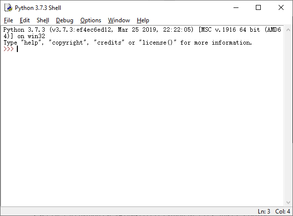
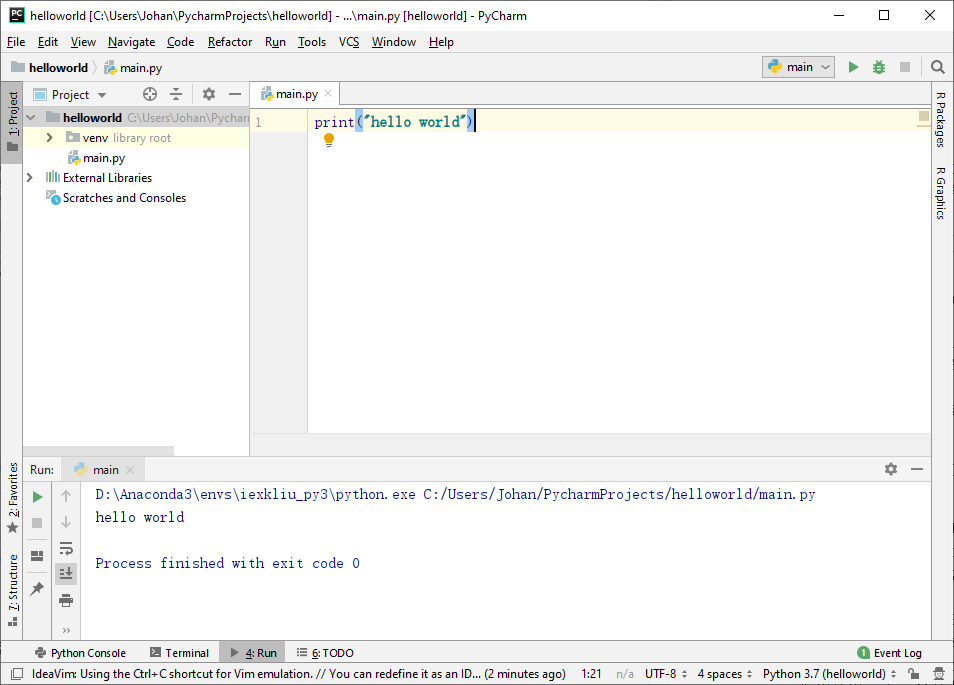
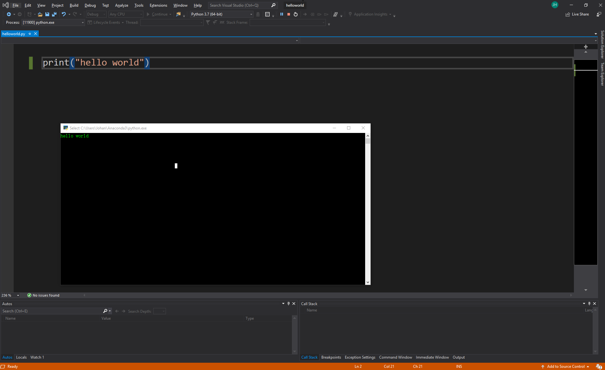
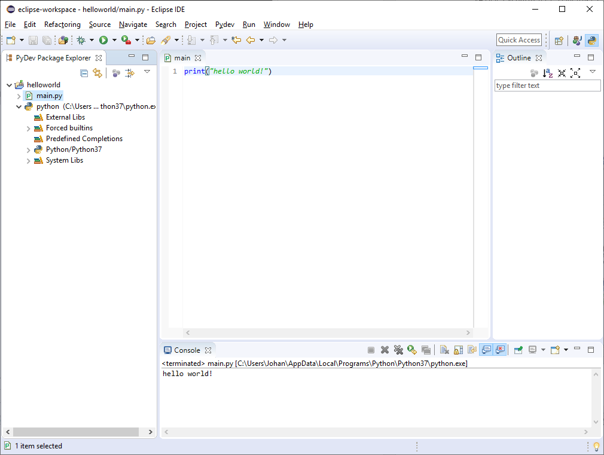

<!--
 * @Author: Johannes Liu
 * @LastEditors: Johannes Liu
 * @email: iexkliu@gmail.com
 * @github: https://github.com/johannesliu
 * @Date: 2021-08-08 02:22:28
 * @LastEditTime: 2022-11-13 17:50:59
 * @motto: Still water run deep
 * @Description: Modify here please
 * @FilePath: \Learning_Advanced_Mathematics_with_Python\Chapter1\1.6-Integrated_Development_Environment.md
-->
# 1.6 集成开发环境

本章对各主流IDE进行介绍。受制于篇幅，只对IDLE进行详细讲解，其他IDE的配置流程大致相同，即：添加Python环境设置默认Python环境，仅仅两步，就可完成这些IDE下，Python环境的搭建。故我们在这里只对除IDLE以外的IDE的配置过程进行大致概括，不会讨论它们的细节，但是鼓励您在internet上探索与您的需求相关的主题。

## 1.6.1 IDLE

配合Python进行开发的工具有很多，其中一些是文本编辑器，还有一部分集成开发环境（Integrated
Development Environment,
IDE）,IDE是用于程序开发的软件，一般包括代码编辑器、解释器、调试器和图形用户界面工具。IDE为用户编程语言开发项目提供了很

IDLE
是开发Python程序的基本IDE，在安装Python环境后，IDLE可自动被装入系统，具备基本的IDE功能。IDLE使用平Python的Tkinter模块编写，基本功能包括语法加亮、段落缩进、基本文本编辑、Tab键控制、调试程序等。

IDLE打开后是一个增强的交互命令行解释器窗口（具有比基本的交互命令提示符更好的剪切-粘贴、回行等功能），如图1-11所示。除此之外，还有一个针对Python的编辑器（无代码合，但有语法标签加亮和代码自动完成功能、类浏览器和调试器。

图1-11 IDLE主界面

如果希望在用户自定义环境下进行调试，只需要在终端中激活环境后，输入IDLE即可。

IDLE为编写Python程序提供了基本的集成环境，但它的功能还不够强大，下醒项目管理、版本控制、智能提示等方面远不如其他IDE。因此，如果要开发比较大型的Python项目，则不建议使用IDLE。

## 1.6.2 PyCharm

PyCarm是一款非常好用的平台Python
IDE，使用Java语言开发，有收费版本和社区免费版本。读者可以到http://www.jetbrains.com/pycharm/download/下载其社区免费（Community）版本。

首先，Python具有一般IDE具备的功能，如调试、语法加亮、project管理、代码跳转、智能提示、自动完成、单元测试、版本控制等。此外，PyCarm还提供了一些很好的用于Django开发功能，同时，其支持Google
APP Engine和IronPython。

下载pycharm的安装包并安装，选择设置主题等操作后程序会自动启动并打开pycharm程序。Pycharm的主界面如图1-12所示。

图1-12 PyCharm主界面

选择file-new—Python
file选项即可新建文件，并在其中编写代码。编写完成后选择run-run选项或安装alt-shift-F10快捷键即可运行代码。

## 1.6.3 Visual Studio

Microsoft Visual
Studio是VS的全称。VS是美国微软公司的开发工具包系列产品。VS是一个基本完整的开发工具集，它包括了整个软件生命周期中所需要的大部分工具，如UML工具、代码管控工具、集成开发环境(IDE)等等。所写的目标代码适用于微软支持的所有平台，包括[Microsoft
Windows](https://baike.baidu.com/item/Microsoft%20Windows)、Windows
Mobile、Windows CE、.NET Framework、.Net Core、.NET Compact Framework和Microsoft
[Silverlight](https://baike.baidu.com/item/Silverlight) 及Windows Phone。

Visual
Studio作为“宇宙第一IDE”，集成了智能感知、Azure开发、概要分析等功能，是一款功能强大的Python开发环境。如图2.x所示为使用visual
studio 2019搭建的Python开发环境。

图2.x Visual Studio主界面

## 1.6.4 Eclipse

Eclipse是用Java语言开发的一个集成开发环境，而且是一个开源项目。Eclipse具有很好的扩展性，不但其原生程序可以作为Java的IDE，还有大量的插件来支持其他语言的开发。在eclipse平台上安装pydev插件就可以运行Python的开发工作了。

图1-12 Eclipse 主界面

Ecplise也非常强大，实现了Python代码的语法加亮、代码提示和代码补全等智能化功能。如图1-12所示为使用eclipse加pydev插件搭建的Python开发环境。