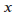
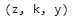
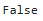
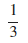
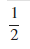
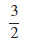

<!--
 * @Author: Johannes Liu
 * @LastEditors: Johannes Liu
 * @email: iexkliu@gmail.com
 * @github: https://github.com/johannesliu
 * @Date: 2021-08-08 02:22:28
 * @LastEditTime: 2022-11-13 18:59:01
 * @motto: Still water run deep
 * @Description: Modify here please
 * @FilePath: \Learning_Advanced_Mathematics_with_Python\Chapter2\2.3-Grammar_of_SymPy.md
-->
# 2.3 SymPy语法

## 2.3.1 数学符号的创建

一门优秀编程语言最重要的优点之一即：贴近自然语言。SymPy尽可能地保留了原有的数学习惯，但是不可避免地在某些情况下，还需要进行额外的声明，来保证代码语义的确定性。

我们使用sympy库下的symbols函数来创建一个数学变量。

symbols函数的使用方法如下：

```python
symbols(‘str1[, str2, …]’)
```

symbols的传入参数为一个或多个字符串对象，依次返回对应的sympy符号对象类型。

```python
[2]:x=symbols(‘x’)

x
```

\[2\]: 

```python
[3]:y, z, k=symbols(‘z k y’)

y, z, k
```

\[3\]: 


在这种赋值情况下，变量z，k，y对应的符号不再是’z’, ‘k’,
‘y’，而是发生了错位。这也就是说，变量的实际符号，与变量的名称无关。

## 2.3.2 符号表达式

在数学上，等号‘=’通常有两层含义，赋值与等价。当我们尝试为变量S赋值时如，我们不会认为等号的意义是等价，当我们在解含有未知量x的方程的时候，如，我们同样也不会认为等号的意义是赋值。在Python中，我们使用=代表赋值，==号代表等价，而SymPy保留了这个传统。

但是，Python中的等价与数学上的等价又有区别，Python中的等价会严格比较’==’左右的表达式结构，而数学上的等价则是比较两端化简规约后是否相等。
```python
[4]:(x+1)^2==x^2+2x+1
```

\[4\]: 

如果您学习过Matlab或Mathematica等编程语言，那么通常我们会习惯性地用\^来进行幂运算，用/来进行除法运算。在Python中双星号\*\*代替了\^的职能，\^的功能是进行异或运算，而/的作用则是进行数值除法运算。

如果我们希望保留分数形式，那么我们需要使用SymPy下的Rational函数

Rational函数的用法如下：
```python
Rational(dividend, divisor)
```
例：分别使用分数形式与实数形式表示$$1/3$$的计算结果：
```python

[5]:1/3

0.3333333333333333

[6]:from sympy import Rational

Rational(1, 3)
```
\[6\]:


## 2.3.3 当 SymPy遇见Python

最后我们将要探讨当SymPy数据类型与Python数据类型进行混合计算时，计算结果的数据类型问题。

当多个SymPy数据类型进行计算时，会按定义在SymPy数据类型上的操作方法进行，计算结果仍然为SymPy类型。当SymPy与Python数据类型进行混合运算需要遵循由简到繁的原则，即先Python内置数据类型要转换为SymPy数据类型，然后按照SymPy数据类型的运算规则进行计算

例: 使用分数形式表示式子$$1/2$$与$$1/2+1$$的计算结果：
```python
[]:Rational(Integer (1)/Integer(2))
```
[]:
```python
[]:type(Rational(Integer (1)/Integer(2)))

<class 'sympy.core.numbers.Half'\>
[]:Rational(Integer (1)/Integer(2))+1
```

\[\]:

```python
[]:type(Rational(Integer (1)/Integer(2))+1)
<class 'sympy.core.numbers.Rational'\>
```
