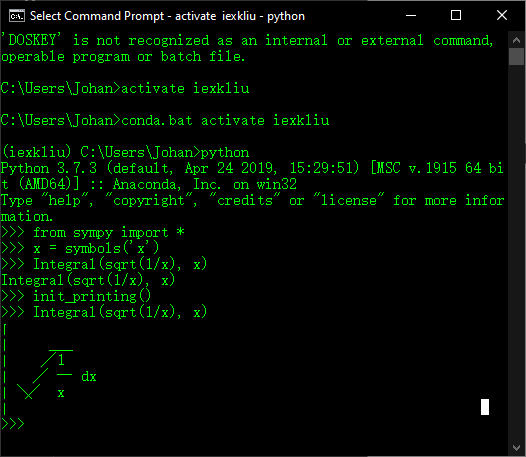
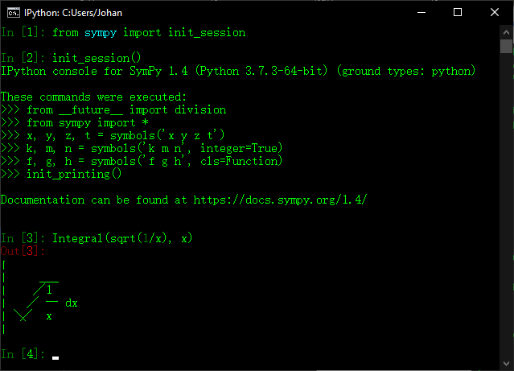

# 3.2 打印

通过前面的例子，我们可以发现，Jupyter
Lab可以对SymPy符号进行优美地展现。事实上，我们还可以通过自定义打印机，来根据我们实际需求打印不同风格的数学符号。常用的打印机有str，srepr，ASCII，Unicode，LaTex，
MathML，Dot。

我们可以使用init_print()函数自动启用环境中可用的最佳打印机以获得最好的打印效果。下面让我们尝试在默认Python解释器中输出下列积分符号：

\>\>\>from sympy import \*

\>\>\>x=symbols(‘x’)

\>\>\>Integral(sqrt(1/x), x)

\>\>\>init\_printing()

\>\>\>Integral(sqrt(1/x), x)

输出结果如图所示

图

如果在交互式计算器类型的会话中工作，init_session()函数将自动导入SymPy中的所有内容，与此同时，创建一些公共符号，设置绘图，并运行init_printing()。如图所示

图

此外，还需要注意以下几点：

1.  如果LATEX被安装，那么在Ipython QTConsole中，打印机将使用Latex

2.  要显式地不使用LATEX，请将use_latex=False传递给init_printing()或init_session()。要显式地不使用Unicode，传递use_unicode=False。

3.  在IPython控制台会话或常规Python会话中，如果终端支持Unicode，它将使用Unicode
    pretty打印机。在不支持Unicode的终端中，使用ASCII pretty打印机。
