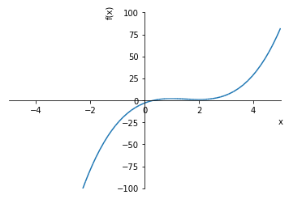

# 4.2 微分

## 4.2.1 一阶导数

例：使用定义法求函数$$f(x)=2013x^2$$的导数。
```python
[]:f=Lambda(x, 2013\*x\*\*2)

limit((f(x+t)-f(x))/t, t, 0, '+')

[]:4026
```
我们在前边分别使用两个函数来计算一个分段函数，目的是熟悉函数创建方法。然而使用这种方法创建分段函数，不仅更麻烦，而且不合数学逻辑。通过使用Piecewise函数，我们可以创建数学意义上的分段函数。使用替换方法subs可以对未知变量进行替换，通常用来求值。

例：已知函数$$
f(x) = \begin{cases}
\frac{1}{2}(x^2+1)  & (x\le 1) \\
\frac{1}{2}(x+1) & (x\gt 1)
\end{cases}
$$判断$$f(x)$$在$$x=1$$处是否可导。

```python
[]:f=Piecewise((Rational(1/2)\*(x\*\*2+1),x\<=1), (Rational(1/2)\*(x+1),x\>1))

limit((f.subs(x, 1+t)-f.subs(x, 1))/t, t, 0, '-'),limit((f.subs(x,
1+t)-f.subs(x, 1))/t, t, 0, '+')

[]:(1, 1/2)
```
例：用定义法求$$
f(x) = \begin{cases}
x^2 \sin \frac{1}{x},  & x\ne 0 \\
0, & x = 0
\end{cases}
$$在x=0点的导数。
```python
[]:f=Piecewise((x\*\*2\*sin(1/x), x!=0), (0,x==1))

limit((f.subs(x, 1+t)-f.subs(x, 1))/t, t, 0, '-'),limit((f.subs(x,
1+t)-f.subs(x, 1))/t, t, 0, '+')

[]:(-cos(1) + 2\*sin(1), -cos(1) + 2\*sin(1))
```
截止到目前，我们都是在使用定义法求导数，除此之外，我们还可以使用diff()对函数求导

例：设$$
f(x) = \begin{cases}
xe^x - 1,  & x \le 0 \\
\sin x - 1, & x \gt 0
\end{cases}
$$，求$$f(x)$$在$$x=0$$处的导数值。（=1）
```pytonn
[]:f=Piecewise((x\*\*2\*sin(1/x), x!=0), (sin(x)-1,x==0))

diff(f, x)
```

\[\]:

```python
[]: 1
```

## 4.2.2 高阶导数

diff()函数还可以用于求高阶导数：在一阶求导情况中，diff()函数接受的第一个参数为待求导表达式，第二个参数为目标求导符号，可以通过在第二个参数后追加目标球到符号的方式来求特定表达式的高阶导数。例如：diff(f(x),
x, x, x)是对f(x)函数求关于x的三阶导数。 diff(f(x, y), x, y,
x)是对f(x)先求关于x的导数，再求关于y的导数，最后求关于x的导数。

在对表达式关于单参数求多次导的情况中，可以通过向diff()函数第二个参数位置中传入包含待求导符号与求导次数的元组。来对目标求导函数求高次导数。例如：diff(f(x),
(x, 3))是对f(x)求3次导数。

例：求对数函数$$y= \log (1+x) $$的5阶导数。

```python
[]:f=Lambda(x, log(1+x))

diff(f(x),(x, 5))
```

\[\]:

例：验证方程$$\sin y + e^x - xy - 1 = 0 $$在点（0,0）某邻域可确定 一个单值可导隐函数$$y = f(x)$$, 并求 $$\frac{dy}{dx}|_{x=0}, \frac{d^2 y}{dx^2} |_{x=0} $$。

在本例中，我们需要判断目标方程在点（0,0）某邻域可确定 一个单值可导隐函数。

根据二元函数隐函数的存在唯一定理，若函数满足以下条件：

1. $$ F(x,y) $$在 $$P_0 (x_0,y_0 )$$ 为内的某一区域 $$D\subset R^2 $$ 上连续 

2. $$ 	F(x,y)$$ 满足初始条件 $$F(x_0,y_0 )=0 $$

3. $$	F(x_0,y_0 )$$ 在D内存在连续的偏导数 $$F_y (x,y) $$

4. $$ 	F_y (x_0,y_0 )\ne0 $$ 

那么有以下结论成立：

1.  $$ \exists $$点$$ P_0 (x_0,y_0 )$$ 在某邻域 $$U(P_0 )\subset D$$,在$$ U(P_0 )$$ 上$$ F(x,y)=0$$ 唯一地决定了一个定义在某区间$$ [x_0-\alpha,x_0+\alpha]$$ 上的隐函数$$ y=f(x)$$ ，使得当$$ x\in[x_0-\alpha,x_0+\alpha]$$ 时，$$ (x,f(x))\in U(P_0 )$$ , 且$$ F(x,f(x))=0,f(x_0 )=y_0 $$

2.  $$	f(x)$$在$$[x_0-\alpha,x_0+\alpha]$$上连续 

我们先创建关于目标方程的符号SymPy函数：

```python
[]:y=Function('y')

f=Lambda(x, sin(y(x))+exp(x)-x\*y(x)-1)
```

根据题干，易得 $$F(x,y) |_{x=0,y=0} =(\sin y+e^x-xy-1) |_{x=0,y=0}=0 $$ 故条件2成立：

```python
[]:f(x).subs(x, 0).subs(y(0), 0)
```

\[\]:

又因为 $$ F(x, y) = \sin y + e^x -xy - 1 $$ 与 $$F_y (x,y)=-x + \cos y(x) $$在 $$U(0,0)$$ 在内显然连续，故条件1, 3成立。且 $$F_y(0, 0) =1 \ne 0$$。

```python
f_dy=Lambda(x, diff(f(x), y(x)))

f_dy(x).subs(x, 0).subs(y(0), 0)
```

故条件4成立，根据隐函数存在与唯一定理可知，$$\exists$$ 点 $$ P_0(x_0, y_0) $$在某邻域$$U(P_0) \subset D $$，在$$U(P_0)$$上$$F(x, y) = 0$$唯一地决定了一个定义在某区间$$[x_0-\alpha, x_0+\alpha]$$上的隐函数$$y=f(x)$$，使得当$$x\in[x_0 -\alpha, x_0 + \alpha] $$时，$$(x,f(x))\in U(P_0 )$$,
且$$F(x,f(x))=0,f(x_0 )=y_0$$，且$$f(x)$$在$$[x_0-\alpha, x_0+\alpha]$$上连续

接着，我们需要求求处y(x)的一阶与二阶导数$$y'(x)$$与$$y''(x)$$。

```python
r1=solveset(Eq(diff(f(x), (x, 1)),0), diff(y(x), (x, 1)))

r2=solveset(Eq(diff(f(x), (x, 2)),0), diff(y(x), (x, 2)))
```
使用subs()方法将$$y'(x)$$中的$$x$$符号替换为0以求得$$y'(0)$$的值，并分别将$$y''(x)$$中的$$y'(x)$$和$$x$$符号替换为$$y'(0)$$的值与$$0$$。

```python
r1.subs(y(x), 0).subs(x, 0),r2.subs(diff(y(x), x),-1).subs(y(x), 0).subs(x, 0)
```

\[\]:

## 4.2.3 参数方程求导

例：设$$
\begin{cases}
x  & = \sin t \\
y & t - \cos t
\end{cases}
$$，求$$\frac{\partial^2 y}{dx^2}$$。

根据链式法则，，其中，可对参数方程求导问题进行解决：
```python
[]:f=Lambda(x, sin(x))

g=Lambda(x, x-cos(x))

(((f(x).diff(x)/g(x).diff(x)).diff(x))/g(x).diff(x)).simplify()
```

\[\]:

## 4.2.4 导数应用

例：确定函数$$f(x) = 2x^3 - 9x^2 +12 x - 3$$的单调区间。

在本例中，我们先求的关于的一阶导数与二阶导数的零点
```python
[]:f=Lambda(x, 2\*x\*\*3-9\*x\*\*2+12\*x-3)

f1=Lambda(x, diff(f(x), x))

f2=Lambda(x, diff(f(x), x,x))

r1=list(solveset(Eq(diff(f(x), (x, 1)),0), x))

r2=list(solveset(Eq(diff(f(x), (x, 2)),0), x))

r1,r2
```

\[\]:

由计算结果可知：函数拥有两个可疑极值点：-1与2.其中$$f''(x)$$的零点为$$\frac{3}{2}$$，因为$$f(x)$$为关于x的3阶多项式，故无限阶可导，且易得$$f'''(x) = 12 > 0$$。因此，可以判别 $$ f''(x)<0, x\in(-\infty, \frac{3}{2}), f''(x)>0, x\in(\frac{3}{2}, +\infty)$$。进一步可得，$$f'(x)>0, x\in(-\infty, 1)\bigcup(2, +\infty), f'(x)<0, x\in(\frac{3}{2}, 2)$$

故$$f(x)$$在$$(-\infty, 1)\cup(2, +\infty)$$上单调递增，在$$(\frac{3}{2}, 2)$$上单调递减。

使用plot()函数做出关于函数$$f(x), x\in(-5, 5)$$的图像，可以验证我们的结论：
```python
[]:plot(f(x),(x, -5, 5), ylim=(-100, 100))
```


```python
[]:<sympy.plotting.plot.Plot at 0xfd8cd30\>
```