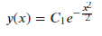
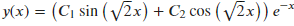
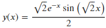

# 4.4 常微分方程

sympy提供了sympy.ode.dsolve()函数用来求解常微分方程。

dsolve()函数的用法如下：

sympy.solvers.ode.**dsolve**(*eq*, *func=None*, *hint='default'*,
*simplify=True*, *ics=None*, *xi=None*, *eta=None*, *x0=0*, *n=6*,
*\*\*kwargs*)[[source]](https://docs.sympy.org/latest/_modules/sympy/solvers/ode.html#dsolve)[¶](https://docs.sympy.org/latest/modules/solvers/ode.html#sympy.solvers.ode.dsolve)

其中,
eq可以使任意支持的常微分方程，它可也是一个等式，也可以是一个表达式。当eq是一个表达式时，假设它等于0。

func为一个变量的函数，其在该变量中的导数构成常微分方程eq。它将被自动检测(如果无法检测，则会引发一个错误)。

hint是您希望dsolve使用的求解方法。使用classify\_ode(eq,
f(x))获取ODE的所有可能提示。默认提示default将使用classify_ode()首先返回的任何提示。

simplify通过odesimp()实现简化。有关更多信息，请参见它的文档字符串。例如，关闭此选项可禁用对func的求解或任意常数的简化。它仍然会与这个提示相结合。注意，如果启用此选项，解决方案可能包含比ODE的顺序更多的任意常数。

xi和eta是常微分方程的无穷小函数。它们是微分方程不变的点变换李群的无穷小。用户可以为无穷小指定值。如果没有指定任何值，则使用infinitesimals()在各种启发式的帮助下计算xi和eta。

ics是微分方程的一组初始/边界条件。它应该以{f(x0): x1,
f(x).diff(x)的形式给出。subs(x, x2):
x3}等等。对于幂级数溶液，如果没有指定初始条件，则假定f(0)为C0，幂级数解的计算值为0左右。

x0是求微分方程幂级数解的点。

n给出因变量的指数，在此之前，微分方程的幂级数解将被求值。

下面让我们通过两个例子来对常微分方程的求解方法进行讲解.

## 常微分方程的通解

例：求的通解。（ 方程通解为 ）

在本例中，直接在dsolve()函数中传入待求常微分方程以及希望求解的函数，即可求得该常微分方程的通解。

[]:y=Function('y')

dsolve(Eq(diff(y(x),x)+x\*y(x)), y(x))

[]:

## 常微分方程的特解

例：求方程满足初始条件的全部解。

在本例中，我们使用前面所述的方法求得该常微分方程的通解：

[]:dsolve(Eq(y(x).diff(x,x)+2\*y(x).diff(x)+3\*y(x)), func=y(x))

[]: 

为了求得该方程在初始条件下的特解，需要额外指定两个超参数，ics，以及n。其中ics以集合的形式接收常微分方程的初始条件，n为因变量的指数。在本例中，ics={y(0):
0, y(x).diff(x).subs(x, 0): 1}, n=2。

[]:dsolve(Eq(y(x).diff(x,x)+2\*y(x).diff(x)+3\*y(x)), func=y(x),

ics={y(0): 0, y(x).diff(x).subs(x, 0): 1}, n=2

)

[]: 
