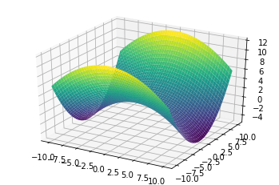

<!--
 * @Author: Johannes Liu
 * @LastEditors: Johannes Liu
 * @email: iexkliu@gmail.com
 * @github: https://github.com/johannesliu
 * @Date: 2021-08-08 02:22:28
 * @LastEditTime: 2022-11-13 22:44:07
 * @motto: Still water run deep
 * @Description: Modify here please
 * @FilePath: \Learning_Advanced_Mathematics_with_Python\Chapter4\4.6-Space_Analytic_Geometry.md
-->
# 4.6 空间解析几何

关于空间图形的绘制我们在3.2节已经进行国详细讲解，在此我们仅补充一个例子来对旋转双曲面进行展示。

例：画出方程$$\frac{x^2}{16} - \frac{y^2}{9} + \frac{z^2}{4} = 1$$所确定的旋转双曲面

[]:plot3d(1 - x\*\*2/16 + y\*\*2/9, aspect_ratio=(1, 1, 1))

[]:\<sympy.plotting.plot.Plot at 0x13fa54e0\>
