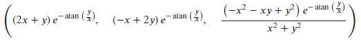

<!--
 * @Author: Johannes Liu
 * @LastEditors: Johannes Liu
 * @email: iexkliu@gmail.com
 * @github: https://github.com/johannesliu
 * @Date: 2021-08-08 02:22:28
 * @LastEditTime: 2022-11-13 22:42:44
 * @motto: Still water run deep
 * @Description: Modify here please
 * @FilePath: \Learning_Advanced_Mathematics_with_Python\Chapter4\4.7-Partial_Derivative.md
-->
# 4.7 偏导数

## 多元函数偏导与全微分

例：设函数$$z= z(x, y)$$由方程$$z=e^{2x-3y} + 2y$$确定，求$$3\left ( \frac{\partial z}{\partial x} + \frac{\partial z}{\partial y} \right )|_{x=3, y=2}$$的值

[]:f=Lambda((x, y), exp(2\*x-3\*y)+2\*y)

(3\*f(x, y).diff(x)+f(x, y).diff(y)).subs(x, 3).subs(y, 2)

[]:

例：求函数$$z=\cos \sqrt{x^2 + y^2}$$的偏导数$$\frac{\partial z}{\partial x}$$, $$\frac{\partial z}{\partial y}$$, $$\frac{\partial^{2} z}{\partial x \partial y}$$，全微分$$dz$$以及$$dz|_{x=1, y=2} $$

```python
[]:f=Lambda((x, y), cos(sqrt(x\*\*2+y\*\*2)))*

f(x, y).diff(x), f(x, y).diff(y), f(x, y).diff(x, y)*

*[]:*

*[]:float(f(x, y).diff(x).subs(x,1).subs(y, 2)), float(f(x, y).diff(y).subs(x,
1).subs(y, 2))*
```

*[]:*

例：设函数$$f(u)$$可微，且$$f'(0)=\frac{1}{2}$$，求$$z=f(4x^2-y^2)$$在点$$(1,2)$$处的全微分$$dz|_{(1, 2)}$$。

```python
[]:f=Function('f')

x, y =symbols('x y')

f(4\*x\*\*2-y\*\*2).diff(x).subs(x, 1).subs(y, 2),
f(4\*x\*\*2-y\*\*2).diff(y).subs(x, 1).subs(y, 2)

[]: 
```
例：设$$z=(x^2+y^2)e^{-\arctan \frac{y}{x}}$$，求$$dz$$与$$\frac{\partial^2 z}{\partial x \partial y}$$。

```python
[]:f=Lambda((x, y), (x\*\*2+y\*\*2)\*exp(-atan(y/x)))

f(x, y).diff(x).simplify(), f(x, y).diff(y).simplify(), f(x, y).diff(x,
y).simplify()
```
[]: 

## 多元函数极值与最值

例：求函数$$f(x,y)=x^2+y^2$$的极值

```python
[]:f=Lambda((x, y), x\*\*2+y\*\*2)

linsolve([f(x, y).diff(x), f(x, y).diff(y)], (x, y))
```
[]: 

```python
[]:(f(x, y).diff(x, y))\*\*2-f(x, y).diff(x, x)-f(x, y).diff(y, y)
```

[]: 

```python
[]:f(x, y).diff(x, x).subs(x, 0)
```

[]: 