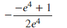
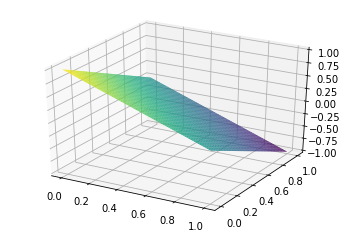
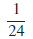
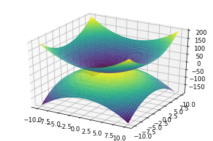
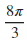
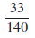
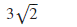
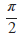

# 4.8 重积分

## 重积分的计算

在Integrate()函数中嵌套多层Integrate()函数可以对重积分进行计算。

例：计算积分的值。
```python
[]:integrate(integrate(exp(-y\*\*2), (y, x, 2)), (x, 0, 2)).simplify()
```

\[\]:

例：计算三重积分其中为平面与三个坐标面，，围成的闭区域。（）

```python
[]:plot3d(1 - x - y, (x, 0, 1), (y, 0, 1), aspect_ratio=(1, 1, 1))
```



```python
[]:<sympy.plotting.plot.Plot at 0x12701ba8\>

[]:integrate(integrate(integrate(z, (z, 0, 1-x-y)), (y, 0, 1-x)), (x, 0, 1))
```

[]:

## 重积分的应用

例：求曲面和围成的体积

首先使用plot3d绘制出曲面图形:

```python
[]:plot3d((x\*\*2+y\*\*2), (2-x\*\*2-y\*\*2))
```

```python
[]:\<sympy.plotting.plot.Plot at 0x141fc6d8\>

[]:integrate(integrate(integrate(1,(z, r\*\*2, 2-r\*\*2)), (r, 0, 1)), (theta,
0, 2\*pi))
```
\[\]:

例：计算曲面和 所围成体积
```python
[]:plot3d(x\*\*2+2\*y\*\*2,3-2\*\*2-y\*\*2)
```
由图像可知，所求体积，其中积分区域2}。使用极坐标计算此积分，
```python
integrate(integrate(integrate(6\*r-r\*r\*\*3, (r, 0, sqrt(2)), (theta, 0,
2\*pi))
```
例：求
```python
[]:integrate(integrate(x\*\*2+y, (y, x\*\*2, sqrt(x))), (x,0,1))
```
\[\]:

## 曲线积分
```python
[]:from sympy import Curve, line_integrate, E, ln

from sympy.abc import x, y, t

*[]:C = Curve([E\*\*t + 1, E\*\*t - 1], (t, 0, ln(2)))*

*line_integrate(x + y, C, [x, y])*
```

[]:

## 曲面积分

*在Jupyter Lab中对该积分进行计算：*

```python
*[]:integrate(integrate(integrate((2\*r\*cos(theta)+2\*r\*sin(theta)+1)\*r*

*, (z3,0, 1-r\*\*2)), (r, 0, 1)), (theta, 0, 2\*pi))*

[]: 
```