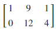
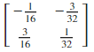
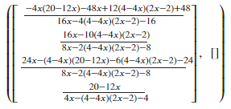
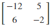
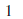
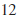

<!--
 * @Author: Johannes Liu
 * @LastEditors: Johannes Liu
 * @email: iexkliu@gmail.com
 * @github: https://github.com/johannesliu
 * @Date: 2021-08-08 02:22:28
 * @LastEditTime: 2022-11-13 21:52:40
 * @motto: Still water run deep
 * @Description: Modify here please
 * @FilePath: \Learning_Advanced_Mathematics_with_Python\Chapter5\5.1-Multinomial_and_Quadratic_Forms.md
-->
# 5.1 矩阵与行列式

## 5.1.1 矩阵运算

SymPy中的矩阵运算重载了Python标准运算符，其含义与一般数学含义相同，具体运算结果，请见下例：

例：设$$A=
\begin{pmatrix}
1 & 3  \\
2 &  4
\end{pmatrix} 
$$，$$B=
\begin{pmatrix}
-2 & 0 & 4 \\
1 & 3 & -1 \\
1 & 3 & -1
\end{pmatrix}
$$，求AB。

[]:A=Matrix([[1, 3], [2, 4]])

B=Matrix([[-2, 0, 4], [1, 3, -1]])

A\*B

[]:

例：设$$A=
\begin{pmatrix}
1 & 3  \\
3 &  1
\end{pmatrix}$$,

$$B=
\begin{pmatrix}
2 & 0  \\
0 & -4
\end{pmatrix}$$，则 （ ）

[]:A=Matrix([[1, 3], [3, 1]])

B=Matrix([[2, 0], [0, -4]])

A\*\*(-1)\*B\*\*(-1)

[]:

例：用初等行变换解线性方程组：$$
\begin{cases}
2x_1-x_2-x_3+x_4 & = 2 \\
x_1+x_2-2x_3+x_4 & = 4 \\
4x_1-6x_2+2x_3-2x_4 & = 4 \\
3x_1+6x_2-9x_3+7x_4 & = 9
\end{cases}
$$

在本例中，我们使用矩阵的gauss_jordan_solve()方法，解线性方程组。也即使用gass-jordan消元法来求解线性方程组。

**gauss_jordan\_solve**(*B*, *freevar=False*)方法的使用方法如下：

B是Ax=B等式右侧的矩阵。feevar是一个list对象，如果系统是欠定的(例如A的列数多于行数)，就有可能用自由变量的任意值表示无限解。如果将freeva设置为true，那么解中的自由变量(列矩阵)的索引将由freevar返回 可能有0个、1个或无穷多个解。如果存在一个解决方案，它将返回。如果存在无穷多个解，它将参数化返回。如果没有解决方案，它将抛出ValueError。gauss_jordan_solve返回两个矩阵，其中第一个矩阵为满足的矩阵，第二个矩阵当且仅当系统为欠定（A的列数多于行数）时，产生可以用任意参数得到的无限解时返回，这些任意参数作为参数矩阵返回。

```python
>   []:L1=[2, -1, -1, 1]

>   L2=[1, 1, -2, 1]

>   L3=[4, -6, 2, -2]

>   L4=[3, 6, -9, 7]

>   B=[2, 4, 4, 9]

>   A.gauss\_jordan_solve(Matrix(B),freevar=False)
```

>   []:

例：设矩阵$$A=
\begin{pmatrix}
2 & 1  \\
5 & 3
\end{pmatrix}$$，$$B=
\begin{pmatrix}
1 & 3  \\
2 & 0
\end{pmatrix}$$ ，求矩阵方程$$XA=B$$的解$$X$$.

```python
[]:A=Matrix([[2, 1], [5, 3]])

B=Matrix([[1, 3], [2, 0]])

X=B\*A\*\*(-1)

X
```
[]:

## 5.1.2 行列式运算

矩阵的det()方法可以用来求行列式值。

例：计算$$
D=\left|
\begin{array}{cccc} 
    1  &  1   & 1 & 1  \\ 
    2  &  1   & 1 & -3 \\ 
    1  &  2   & 2 & 5  \\
    4  &  3   & 2 & 1
\end{array}
\right| 
$$。
```python
[]:A=Matrix([[1, 1, 1, 1], [2, 1, 1, -3], [1, 2, 2, 5], [4, 3, 2, 1]])

det(A)
```
[]:

例：计算$$
D=\left|
\begin{array}{cccc} 
    1  &  1   & 1 & 1  \\ 
    1  &  2   & 3 & 4 \\ 
    1  &  4   & 9 & 16  \\
    1  &  8   & 27 & 64
\end{array}
\right| 
$$。
```python
[]:A=Matrix([[1, 1, 1, 1], [1, 2, 3 ,4], [1, 4, 9, 16], [1, 8, 27, 64]])

A.det()
```
[]: