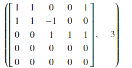
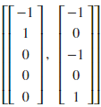
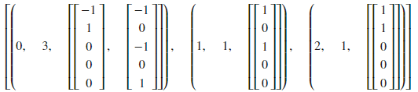
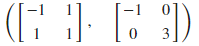
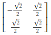
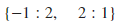
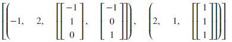

<!--
 * @Author: Johannes Liu
 * @LastEditors: Johannes Liu
 * @email: iexkliu@gmail.com
 * @github: https://github.com/johannesliu
 * @Date: 2021-08-08 02:22:28
 * @LastEditTime: 2022-11-13 21:56:55
 * @motto: Still water run deep
 * @Description: Modify here please
 * @FilePath: \Learning_Advanced_Mathematics_with_Python\Chapter5\5.2-Linear_Equations_and_Quadratic_Forms.md
-->
# 5.2 线性方程与二次型

例：求齐次线性方程组$$
\begin{cases}
x_1+x_2+x_5 = 0 \\
x_1+x_2-x_3 & = 0 \\
x_3+x_4+x_5 & = 0
\end{cases}
$$ 的基础解系及通解.

使用矩阵的rank()方法，可以查看矩阵的秩

[]:A=Matrix([[1, 1, 0, 0, 1], [1, 1, -1, 0, 0], [0, 0, 1, 1, 1],
[0,0,0,0,0],[0,0,0,0,0]])

A, A.rank()

[]: 

由运算结果可知，A的秩为3，因此A应有两个线性无关的解。

使用矩阵的nullspace()可以查看矩阵A的零空间的对应的向量列表，这些向量张成了矩阵A的零空间。

[]:A.nullspace()

[]: 
使用矩阵的eigenvects()方法可以查看矩阵对应的特征值，特征值重数以及对应的特征向量。使用eigenvalues()可以单独查看矩阵对应的特征值。

[]:A.eigenvects()

[]: 

取为该齐次方程组的基础解系,

该齐次方程组的通解为为任意数)

例：设矩阵$$A=
\begin{pmatrix}
1 & 2  \\
2 & 1
\end{pmatrix}$$，求正交矩阵$$P$$，使$$P^{-1}AP$$为对角矩阵。

使用矩阵A的diagonalize()方法将求出使，矩阵P以及D。

[]:A=Matrix([[1, 2], [2, 1]])

P, D = A.diagonalize()

P, D

[]:

由于digonalize()求出的特征向量之间不正交，因此可逆矩阵P非正交矩阵。我们需要将特征向量进行施密特正交化

GramSchmidt()方法将gramm - schmidt过程应用于一组向量。

GramSchmidt()方法的使用方法如下：

GramSchmidt(vlist, orthonormal=False)

vlist为向量的列表。

orthonormal参数是一个布尔值，设为True将返回正交化向量

[]: L=[A.eigenvects()[0][2][0],A.eigenvects()[1][2][0]]

L_schmidt=Matrix(GramSchmidt(L, True)).reshape(2, 2)

L_schmidt

[]: 

，且

例：求矩阵$$A=
\begin{pmatrix}
0 & 1 & 1 \\
1 & 0 & 1 \\
1 & 1 & 0
\end{pmatrix}$的特征值和特征向量。

[]:A=Matrix([[0, 1, 1], [1, 0, 1], [1, 1, 0]])

A.eigenvals()

[]:

矩阵的特征值

[]:A.eigenvects()

[]: 

由运算结果可知，为矩阵的属于特征值的两个线性无关的特征向量，为矩阵的属于特征值的特征向量.
