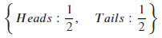

# 6.2 随机变量


本节，我们对概率论中重要的随机变量进行讲解。SymPy中关于随机变量的API都十分简单，在此我们仅仅给出API的一般形式，不再对它们的使用进行详细讲解。读者根据相关实例，就可以掌握这些API的用法。

## 6.2.1 离散型随机变量

### 0-1分布

sympy.stats.Bernoulli(name, p, succ=1, fail=0)

创建一个表示伯努利过程的有限随机变量。如果随机变量X满足伯努利分布，则X的分布律为：

| $$X$$ | $$0$$ | $$1$$ |
|---|---|---|
| <center> $$P$$ </center> |<center> $$1-p$$ </center>  | <center>$$p$$  </center>|

导入函数代码如下：

```python
[]:from sympy.stats import Bernoulli
```

例：随机变量$$X$$服从 $$\left(\begin{array}{cc} 0&1\\ \frac{1}{4}&\frac{3}{4} \end{array}\right) $$ 伯努利分布，计算期望$$E(X)$$

```python
[]:X = Bernoulli('X', S(3)/4) \# 1-0 Bernoulli variable, probability = 3/4

density(X).dict
```

[]: 

```python
[]:E(x)
```

[]:

### 二项分布

sympy.stats.Binomial(*name*, *n*, *p*, *succ=1*, *fail=0*)

创建一个表示二项分布的有限随机变量。如果随机变量X满足伯努利分布，则X的分布律为：
$$ P\{X=k\}=p q^{k-1} ,k=1,2, ... $$

导入函数代码如下：

```python
[]:from sympy.stats import Binomial
```

例：创建任意一个样本空间维度为5的随机变量，计算其期望与方差

```python
[]:X = Binomial('X', 4, S.Half) \# Four "coin flips"

density(X).dict
```

[]:

[]:

### 超几何分布

sympy.stats.Hypergeometric(*name*, *N*, *m*, *n*)

创建一个表示超几何分布的有限随机变量。如果随机变量X满足超几何分布，则X的分布律为：
$$ P\{X=k\}=p q^{k-1} ,k=1,2, ... $$

导入函数代码如下：

```python
[]:from sympy.stats import Hypergeometric
```

例：有十个小球，其中红色小球数量为5，蓝色小球数量为3，白色小球数量为2。现从这些小球中任取3个。设随机变量X为被取中的红色小球个数，求的概率密度，概率分布函数，期望，方差，标准差。

```python
[]:X = Hypergeometric('X', 10, 5, 3) \# 10 marbles, 5 white (success), 3 draws

density(X).dict, cdf(X), E(x), variance(X), std(X)
```

[]:

### 泊松分布

```python
sympy.stats.Poisson(name, lamda)
```

创建一个具有泊松分布的离散随机变量。泊松分布的概率密度为:
$$P{x=k}=\frac{\lambda ^k}{k!} e^{- \lambda },k-=0,1,2, ...$$
导入函数代码如下：

```python
[]:from sympy.stats import Posson
```

例：随机变量服从参数为的泊松分布，求其期望与方差

```python
[]:rate = Symbol("lambda", positive=True)

z = Symbol("z")

X = Poisson("x", rate)

density(X)(z)
```

[]:

```python
[]:E(X), variance(X)
```

[]:

## 6.2.2 连续型随机变量

### 均匀分布

sympy.stats.Uniform(*name*, *left*, *right*)

创建一个均匀分布的连续随机变量。均匀分布的概率密度为：
$$f(x) = \begin{cases}
\frac{1}{b-a} & a\le x \le b \\
0, & Others
\end{cases}
$$
导入函数代码如下：

```python
[]from sympy.stats import Uniform
```

例：随机变量$$X$$在区间$$[a, b]$$上服从均匀分布，求其累积分布函数

```python
[]:a = Symbol("a", negative=True)

b = Symbol("b", positive=True)

z = Symbol("z")

X = Uniform("x", a, b)

density(X)(z)
```

[]:

```python
[]:cdf(X)(z)
```


```python
[]:simplify(E(X)),simplify(variance(X))
```

[]:

### 指数分布

sympy.stats.Exponential(*name*, *rate*)

创建一个指数分布的连续随机变量。指数分布的概率密度为
$$f(x) = \begin{cases}
\frac{1}{\lambda} e^{-\frac{x}{\lambda}} & x\gt \\
0, & x\le 0
\end{cases}, \lambda \gt 0
$$
例：随机变量服从参数为指数分布，求其概率密度，累积分布函数，期望，方差，偏态系数
```python
[]:l = Symbol("lambda", positive=True)

z = Symbol("z")

X = Exponential("x", l)

density(X)(z),cdf(X)(z),E(X),variance(X),skewness(X)
```
[]: 

### 正态分布

```python
sympy.stats.Normal(*name*, *mean*, *std*)
```

创建一个具有正态分布的连续随机变量。正态分布的概率密度为：

导入函数代码如下：
```python
[]:from sympy.stats import Normal
```
例：随机变量服从参数的正态分布，求其概率密度，累积分布函数，偏态系数
```python
mu = Symbol("mu")

sigma = Symbol("sigma", positive=True)

z = Symbol("z")

y = Symbol("y")

X = Normal("x", mu, sigma)

density(X)(z),simplify(cdf(X))(z),simplify(skewness(X))
```
[]: 