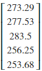

# 6.3 方差分析与回归分析

## 方差分析

### 单因素方差分析

例：考虑温度对某一化工厂产品成品率的影响。选定5中不同的温度各做3次试验，测得结果如表【】所示

| 温度/℃   | 40    | 45    | 50    | 55    | 60    |
|----------|-------|-------|-------|-------|-------|
| 成品率/% | 91.42 | 92.75 | 96.03 | 85.14 | 85.14 |
|          | 92.37 | 94.61 | 95.41 | 83.21 | 87.21 |
|          | 89.50 | 90.17 | 92.06 | 87.90 | 81.33 |

检验温度对某化工厂产品成品率是否有显著影响

解： 本题需要检验假设不全等。

本题的关键是要计算以及，首先，我们创建关于化工产品成品率的矩阵A，令矩阵的行列数分别为m=3与n=5，元素总数为count=9：

[]:m=3

n=5

counts=15

A=np.array([[91.42, 92.75, 96.03, 85.14, 85.14], [92.37, 94.61, 95.41, 83.21,
87.21], [89.50, 90.17, 92.06, 87.90, 81.33]])

Matrix(A)

[]: 

接着，我们计算矩阵A的列向量之和s0：

[]: s0=A.sum(axis=0).T

Matrix(s0)

[]: 

计算矩阵A的yuansu 之和：

[]:A\_sum=A.sum()

[]: 

为了方便计算，我们预先定义关于以及的计算函数：

[]:def St(A, A_sum, counts):

return ((A-A_sum/counts)\*\*2).sum()

[]:def Sa(s0, A_sum, counts, m):

return (((s0/m-A_sum/counts)\*\*2).sum())\*m

[]:def Se(se, sa):

return se-sa

[]:def F(sa, se, n, counts):

return (sa/(n-1))/(se/(counts-n))

带入函数可得以及的值：

[]:St=((A-A_sum/n)\*\*2).sum()

St

[]: 

[]:Sa=(((s1/3-A_sum/n)\*\*2).sum())\*3

Sa

[]: 

[]:Se=St-Sa

Se

[]: 

[]:F=(Sa/(m-1))/(Se/(n-m))

F

[]: 

接下来，我们将计算结果记录在表【】 方差分析表中

表【】 化工产品方差分析表

| 方差来源 | 平方和 | 自由度 | 平均平方和 | F值 | 临界值 |
|----------|--------|--------|------------|-----|--------|
| 组间     |        | 4      |            |     |        |
| 组内     |        | 10     |            |     |        |
| 总和     |        |        |            |     |        |

因为，拒绝原假设，即认为不同的温度对化工产品成品率有特别显著的影响。

例：某灯泡厂用四种不同配料方案制成灯丝，生产了斯皮灯泡，抽样测得使用寿命如表【】所示：

| 配料方案             | 1    | 2    | 3    | 4    |
|----------------------|------|------|------|------|
| 实验数据（使用寿命） | 1600 | 1580 | 1460 | 1510 |
|                      | 1610 | 1640 | 1550 | 1520 |
|                      | 1650 | 1640 | 1600 | 1530 |
|                      | 1680 | 1700 | 1520 | 1570 |
|                      | 1700 | 1750 | 1640 | 1600 |
|                      | 1720 | -    | 1660 | 1680 |
|                      | 1800 | -    | 1740 | -    |
|                      | -    | -    | 1820 | -    |

试问不同的配料方案对灯泡的使用寿命有无显著影响

解：本题需要检验假设不全等。

本题的关键是要计算以及，首先，我们创建关于化工产品成品率的矩阵A，矩阵的列数为n=5，元素总数为count=9，除此之外，我们还需要额外定义一个形状为的列表变量mn用来存储各列元素的个数：

[]:A=np.array([[1600, 1580, 1460, 1510], [1610, 1640, 1550, 1520], [1650, 1640,
1600, 1530],

[1680, 1700, 1520, 1570], [1700, 1750, 1640, 1600], [1720, np.nan,1660, 1680],

[1800, np.nan, 1740, np.nan], [np.nan,np.nan , 1820,np.nan ]])

Matrix(A)

[]: 

[]:n=4

nm=[7, 5, 8, 6]

counts=np.sum(\~np.isnan(A))

counts

[]: 26

为了便于计算矩阵各列向量中元素之和s0，我们一个新的矩阵B用来存储矩阵A中的元素，不同的是，B中的np.nan元素被替换成了0：

[]:B=A

B[np.isnan(B)]=0

B

[]: 

[]:s0=B.sum(axis=0)

s0

[]:array([11760., 8310., 12990., 9410.])

A\_sum用来存储矩阵A中元素之和：

[]:A\_sum=np.nansum(A)

A_sum

[]: 

使用变量s来存储矩阵B的列向量的平方和：

[]:ss=(B\*\*2).sum(axis=0)

ss

为了方便，我们直接计算，对于和，我们代入函数进行计算：

[]:array([19785400., 13828100., 21189700., 14778700.])

[]:st=ss.sum()-A_sum\*\*2/counts

st

[]: 

[]:sa=((s0\*\*2)/nm).sum()-(A_sum\*\*2)/counts

sa

[]: 

[]:se=Se(st, sa)

se

[]: 

[]:f=F(sa, se, n, counts)

f

[]: 

接下来，我们将计算结果记录在表【】 灯泡使用方差分析表中

表【】 灯泡使用方差分析表

| 方差来源 | 平方和 | 自由度 | 平均平方和 | F值 | 临界值 |
|----------|--------|--------|------------|-----|--------|
| 组间     |        |        |            |     |        |
| 组内     |        | 22     |            |     |        |
| 总和     |        | 25     |            |     |        |

因为，所以接受，即认为4种配料方案的使用寿命没有显著影响。

### 双因素方差分析

例：对木材进行抗压强度的试验，选择三种不同比重的木材

及三张不同的加荷速度

测得木材的抗压强度

|  B A | B1   | B2   | B3   |
|------|------|------|------|
| A1   | 3.72 | 3.90 | 4.05 |
| A2   | 5.22 | 5.24 | 5.08 |
| A3   | 5.28 | 5.74 | 5.54 |

检验木材比重及加禾速度对木材的抗压强度是否有显著影响

解： 本题需要检验假设不全等；

不全等。*。*

本题的关键是要计算以及，首先，我们创建关于木材抗压强度的矩阵A，令矩阵的行列数分别为m=3与n=3，元素总数为count=9：

[]counts=9

m=3

n=3

nm=[3, 3, 3, 3]

A=np.array([[3.72, 3.90, 4.05], [5.22, 5.24, 5.08], [5.28, 5.74, 5.54]])

Matrix(A)

[]: 

令s0为矩阵A行元素之和，s1为列元素之和：

[]:s0=A.sum(axis=0)

s1=A.sum(axis=1)

Matrix(s0), Matrix(s1)

[]: 

矩阵元素之和为A\_sum：

[]:A\_sum=A.sum()

A_sum

[]: 

接下来我们来定义Sb，Se2，Fa2，Fb2函数对应：

[]:def Sb(s1, A_sum, counts, n):

return (((s1/n-A_sum/counts)\*\*2).sum())\*n

[]:def Se2(se, sa, sb):

return se-sa-sb

[]:def Fa2(sa, se, m, n):

return (sa/(m-1))/(se/((m-1)\*(n-1)))

[]:def Fb2(sb, se, m, counts):

return (sb/(m-1))/(se/((m-1)\*(n-1)))

带入函数可得值：

[]:st=St(A, A_sum, counts)

st

[]: 

[]:sa=Sa(s1, A_sum, n)

sa

[]: 

[]:sb=Sb(s0, A_sum, n)

sb

[]: 

[]:se=Se2(st, sa, sb)

se

[]: 

[]:fa2=Fa2(sa, se, m, n/m)

fa2

[]: 

[]:fb2=Fb2(sb, se, m, n/m)

fb2

[]: 

接下来，我们将计算结果记录在表【】 木材抗压强度方差分析表：

表【】 木材抗压强度方差分析表

| 方差来源 | 平方和 | 自由度 | 平均平方和 | F值 | 临界值 |
|----------|--------|--------|------------|-----|--------|
| 因素A    |        | 2      |            |     |        |
| 因素B    |        | 2      |            |     |        |
| 误差     |        | 4      |            |     |        |
| 总和     |        | 8      |            |     |        |

因为，所以接受，即认为4种配料方案的使用寿命没有显著影响。

## 回归分析

例：在某种商品表面进行腐蚀刻线的实验，测得腐蚀深度y与腐蚀时间x之间对应的一组数据如表【】所示

|   | 5 | 10 | 15 | 20 | 30 | 40 | 50 | 60 | 70 | 90 | 108 | 120 |
|---|---|----|----|----|----|----|----|----|----|----|-----|-----|
|   | 6 | 10 | 10 | 13 | 16 | 17 | 19 | 23 | 25 | 29 | 38  | 46  |

试给出腐蚀深度y对腐蚀时间x的回归直线方程。

解：在本例中，我们使用np.poly()函数来对数值进行拟合：

[]:x=[6, 10, 11, 13, 16, 17, 19, 23, 25, 29, 38, 46]

y=[5, 10, 15, 20, 30, 40, 50, 60, 70, 90, 108,120]

[]:param=np.polyfit(y, x, 1)

f=np.poly1d(param)

print(f)

[]: 

因此，对数值进行一次多项式拟合的结果为：。

接下来，我们使用matplobli来观测拟合效果，matplotlib的使用方法详见第10章。

[]:from matplotlib import pyplot as plt

%matplotlib inline

[]:plt.rcParams['font.sans-serif']=['SimHei'] \#正常显示正文标签

plt.rcParams['axes.unicode_minus']=False \#正常显示负号

plt.xlabel("时间")

plt.ylabel("腐蚀深度")

plt.title("腐蚀刻度与时间关系图")

axes = plt.gca()

axes.set\_xlim([0,50])

axes.set\_ylim([0,120])

plt.scatter(x, y)

m=np.linspace(0, 50, 100)

n=m\*f[0]+f[1]

plt.plot(n)

plt.show()

[]: 

由matplotlib绘制可以看出函数基本对腐蚀刻线趋势变换进行拟合。
