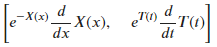
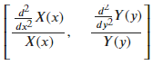

<!--
 * @Author: Johannes Liu
 * @LastEditors: Johannes Liu
 * @email: iexkliu@gmail.com
 * @github: https://github.com/johannesliu
 * @Date: 2021-08-08 02:22:28
 * @LastEditTime: 2022-11-13 20:24:54
 * @motto: Still water run deep
 * @Description: Modify here please
 * @FilePath: \Learning_Advanced_Mathematics_with_Python\Chapter7\7.1-Auxillary_Function.md
-->
# 7.1 辅助函数

使用sympy.solvers.pde.
pde_separate_add可以寻找偏微分方程的适用于加法可分的解的辅助函数。

例：求偏微分方程$$\frac{\partial}{\partial x} u(x,t) = e^{u(x,t)} \frac{\partial }{\partial t} u(x,t)$$ 适用加法可分的解的辅助函数。

```python
[]:from sympy import Function, Derivative as D

u, X, T = map(Function, 'uXT')

eq = Eq(D(u(x, t), x), E\*\*(u(x, t))\*D(u(x, t), t))

eq

[]:pde\_separate_add(eq, u(x, t), [X(x), T(t)])
```

[]: 

使用sympy.solvers.pde.pde_separate_add可以寻找偏微分方程的适用于乘法可分的解的辅助函数。

例：求偏微分方程$$ \frac{\partial {}^2}{\partial x^2 } u(x,y)=\frac{\partial {}^2}{\partial y^2 } u(x,y)$$适用乘法可分的解的辅助函数。

```python
[]:eq = Eq(D(u(x, y), x, 2), D(u(x, y), y, 2))

eq

[]:pde\_separate_mul(eq, u(x, y), [X(x), Y(y)])
```

[]: 
