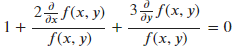
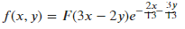

# 7.2 解偏微分方程

使用sympy.solvers.pdesolve()可以对偏微分方程进行求解。

[]:from sympy.solvers.pde import pdsolve

u = f(x, y)

ux = u.diff(x)

uy = u.diff(y)

eq = Eq(1 + (2\*(ux/u)) + (3\*(uy/u)))

eq

[]: 

[]:pdsolve(eq)

[]: 
